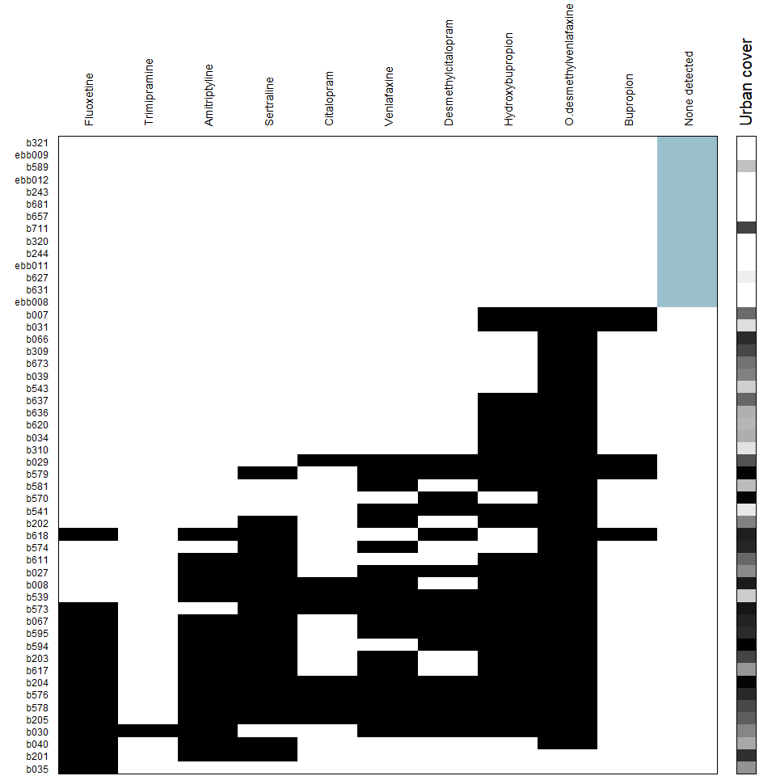
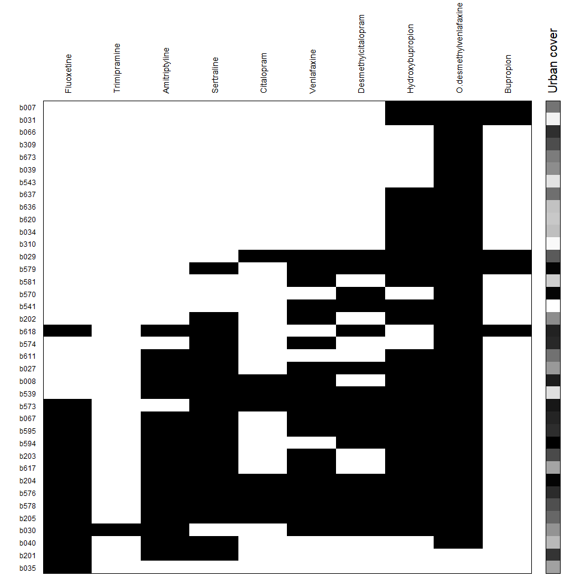

EMS
================
Rodolfo Pelinson
2024-11-14

To plot the matrix I used a custom function called “My_Imagine”.

``` r
source("C:/Users/rodol/OneDrive/repos/Antidepressants_sp/scripts/functions/My_Imagine_function.R")
```

The matrix including sites where no antidepressant was detected.

``` r
My_Imagine(data_farmacos_pa_plot, col = c(0,1, "grey60"), top_margin = 7, left_margin = 3, bottom_margin = 0.1, fill = FALSE,
           Env1 = urb_plot_reverse, Env.col_1 = c("white","black"), Env.label_1 = "Urban cover", order = FALSE, speciesnames = farmacos_plus_empty,
           cex.site = 0.6, cex.species = 0.7, xline = -0.5, yline = -0.5, gap.axis = -10, Empty = ncol(data_farmacos_pa_plot), Empty_col = "lightblue3", speciesfont = 1)
```



The matrix excluding sites where no antidepressant was detected.

``` r
My_Imagine(data_farmacos_pa_no_zero, col = c(0,1, "black"), top_margin = 7, left_margin = 3, bottom_margin = 0.1, fill = FALSE, cex.site = 0.6, cex.species = 0.7, xline = -0.5, yline = -0.5, gap.axis = -10,
           Env1 = urb_no_zero, Env.col_1 = c("white","black"), Env.label_1 = "Urban cover", speciesnames = colnames(data_farmacos_pa_no_zero), speciesfont = 1, Empty = NULL)
```



Actual EMS analysis:

``` r
coerencia <- data.frame(Coherence(data_farmacos_pa_no_zero, method = "r0", sims = 10000, orderNulls = TRUE, order = TRUE, seed = 1, scores = 1, allowEmpty = FALSE))
coerencia$stat <- round(coerencia$stat, 3)

turnover <- Turnover(data_farmacos_pa_no_zero, method = "r0", sims = 10000, fill = FALSE)
turnover$stat <- round(turnover$stat, 3)

bc <- BoundaryClump(data_farmacos_pa_no_zero)
bc$stat <- round(bc$stat, 3)

coerencia
```

    ##          name    stat
    ## 1      embAbs  76.000
    ## 2           z  -3.937
    ## 3           p   0.000
    ## 4     simMean 116.323
    ## 5 simVariance  10.243
    ## 6 method = r0      NA

``` r
turnover
```

    ##          name     stat
    ## 1    turnover  910.000
    ## 2           z  -21.230
    ## 3           p    0.000
    ## 4     simMean 2736.009
    ## 5 simVariance   86.012
    ## 6 method = r0       NA

``` r
bc
```

    ##    name stat
    ## 1 index  5.1
    ## 2     p  0.0
    ## 3    df 35.0

There is a nested pattern of antidepressant with clumped losses.

``` r
scores <- OrderMatrix(data_farmacos_pa_no_zero, outputScores = T)$sitescores
cor.test(scores, urb_no_zero, method = "spearman")
```

    ## 
    ##  Spearman's rank correlation rho
    ## 
    ## data:  scores and urb_no_zero
    ## S = 11855, p-value = 0.07003
    ## alternative hypothesis: true rho is not equal to 0
    ## sample estimates:
    ##       rho 
    ## -0.297147

``` r
scores2 <- OrderMatrix(data_farmacos_pa_no_zero, outputScores = T)$sitescores
scores2 <- scores2[order(scores2, decreasing = TRUE)]
scores_zero <- rep(scores2[1]*1.1, length(bacia_zero))
names(scores_zero) <- names(reordered_urb_zero)
scores2 <- c(scores_zero, scores2)
scores2 <- scores2[length(scores2):1]

cor.test(scores2, urb_plot, method = "spearman")
```

    ## 
    ##  Spearman's rank correlation rho
    ## 
    ## data:  scores2 and urb_plot
    ## S = 7521.5, p-value = 3.163e-08
    ## alternative hypothesis: true rho is not equal to 0
    ## sample estimates:
    ##       rho 
    ## 0.6789233

The gradient in antidepressant composition is associated with the urban
cover gradient when we do not consider sites with no antidepressant
detected. When we consider them, the association is highly significant.
