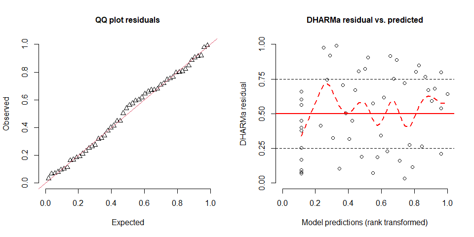
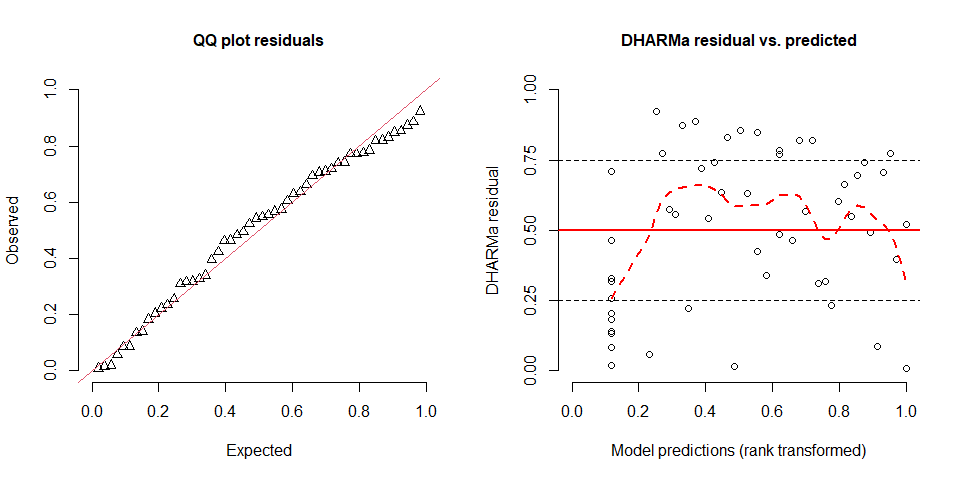
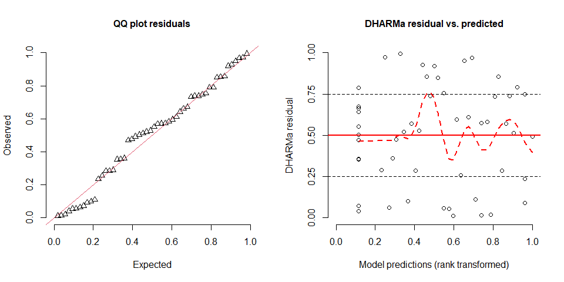
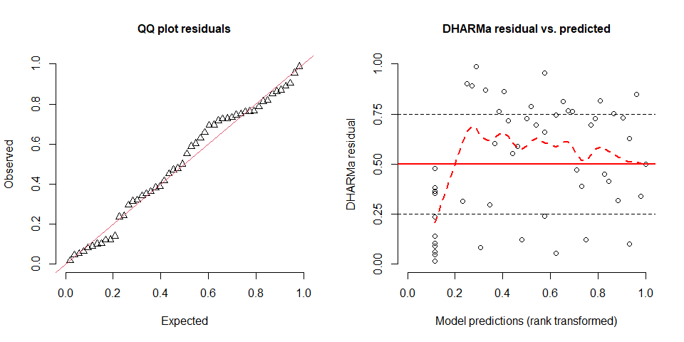

Number of molecules across the gradient in urban cover
================
Rodolfo Pelinson
2024-11-13

``` r
library(vegan)
library(shape)
library(scales)
library(AICcmodavg)
library(bbmle)
library(mgcv)
library(DHARMa)
```

Here we use a custom function that I made to fit several gam models with
different maximum numbers of k and than make model selection using AICc.
This function uses the gam function from mgcv package.

``` r
source("C:/Users/rodol/OneDrive/repos/Antidepressants_sp/scripts/functions/select_gam.R")

n_pharma_model <- select_gam(y = data_farmacos_conc$n_pharma, x = data_farmacos_conc$urb, family = "nb")
par(mfrow = c(1,2))
plotQQunif(simulateResiduals(n_pharma_model$best_model), testUniformity = FALSE, testOutliers = FALSE, testDispersion = FALSE)
```

    ## Registered S3 method overwritten by 'GGally':
    ##   method from   
    ##   +.gg   ggplot2

    ## Registered S3 method overwritten by 'mgcViz':
    ##   method from  
    ##   +.gg   GGally

``` r
plotResiduals(simulateResiduals(n_pharma_model$best_model), quantreg = FALSE, smoothScatter = FALSE, absoluteDeviation = FALSE)
```



``` r
n_pharma_model$AICTAB
```

    ##            dAICc       df
    ## gam_3  0.0000000 6.355794
    ## gam_4  0.0713828 6.374698
    ## gam_2  0.1507220 5.783106
    ## gam_1  2.6125473 3.984888
    ## gam_0 30.2740158 2.000000

``` r
SNRI_model <- select_gam(y = data_farmacos_conc$SNRI, x = data_farmacos_conc$urb, family = "nb", drop.intercept = FALSE)
plotQQunif(simulateResiduals(SNRI_model$best_model), testUniformity = FALSE, testOutliers = FALSE, testDispersion = FALSE)
plotResiduals(simulateResiduals(SNRI_model$best_model), quantreg = FALSE, smoothScatter = FALSE, absoluteDeviation = FALSE)
```



``` r
SNRI_model$AICTAB
```

    ##            dAICc       df
    ## gam_1  0.0000000 3.946905
    ## gam_2  0.5254734 4.475783
    ## gam_3  0.5828330 4.517574
    ## gam_4  0.5893848 4.520094
    ## gam_0 11.1462331 2.000000

``` r
SSRI_model <- select_gam(y = data_farmacos_conc$SSRI, x = data_farmacos_conc$urb, family = "nb")
plotQQunif(simulateResiduals(SSRI_model$best_model), testUniformity = FALSE, testOutliers = FALSE, testDispersion = FALSE)
plotResiduals(simulateResiduals(SSRI_model$best_model), quantreg = FALSE, smoothScatter = FALSE, absoluteDeviation = FALSE)
```



``` r
SSRI_model$AICTAB
```

    ##            dAICc       df
    ## gam_1  0.0000000 3.849178
    ## gam_2  0.6425649 3.985824
    ## gam_3  0.6636154 3.996919
    ## gam_4  0.6657463 3.998135
    ## gam_0 24.8557827 2.000000

``` r
Tricyclic_model <- select_gam(y = data_farmacos_conc$Tricyclic, x = data_farmacos_conc$urb, family = "nb", drop.intercept = FALSE)
plotQQunif(simulateResiduals(Tricyclic_model$best_model), testUniformity = FALSE, testOutliers = FALSE, testDispersion = FALSE)
plotResiduals(simulateResiduals(Tricyclic_model$best_model), quantreg = FALSE, smoothScatter = FALSE, absoluteDeviation = FALSE)
```


``` r
Tricyclic_model$AICTAB
```

    ##           dAICc       df
    ## gam_1 0.0000000 3.897042
    ## gam_2 0.9073586 4.086473
    ## gam_3 0.9614528 4.090324
    ## gam_4 0.9657331 4.089798
    ## gam_0 5.9990059 2.000000

``` r
Aminoketone_model <- select_gam(y = data_farmacos_conc$Aminoketone, x = data_farmacos_conc$urb, family = "nb")
plotQQunif(simulateResiduals(Aminoketone_model$best_model), testUniformity = FALSE, testOutliers = FALSE, testDispersion = FALSE)
plotResiduals(simulateResiduals(Aminoketone_model$best_model), quantreg = FALSE, smoothScatter = FALSE, absoluteDeviation = FALSE)
```



``` r
Aminoketone_model$AICTAB
```

    ##           dAICc       df
    ## gam_1 0.0000000 3.789017
    ## gam_3 0.3178065 3.537721
    ## gam_4 0.3186697 3.538940
    ## gam_2 0.3187493 3.554922
    ## gam_0 2.0776061 2.000000

Our models generally fitted well within the chosen statistical
distribution. Residuals generally exhibited somewhat lower values for
low fitted values for the total concentration of antidepressants, which
might indicate that there might be other important predictors to the
number of antidepressants found in streamwater. Still, all models
including urban cover as a predictor was considered more plausible than
the model without any effect of urban cover. Only the model for the
frequency of Aminoketone antidepressants had the “no effect” model as a
plausible model, though it was at the margin the the threshold for
plausibility (i.e. delta AICc = 2), meaning that the best model is still
fairly more plausible.

   

Ploting the best models:

``` r
ylab.cex <- 0.9
xlab.cex <- 0.9
axis.cex <- 0.75
line_labs <- 1.25
line_axis <- -0.75
tck <- -0.03
cex.points <- 0.7
line_lwd <- 1.25

n_pharma_plot <- function(letter = "", x_letter = 0, y_letter = 100){
  plot(data_farmacos_conc$n_pharma ~ data_farmacos_conc$urb , type = "n", xaxt = "n", yaxt = "n", xlab = "", ylab = "")
  title(xlab = "Urban cover (%)", line = line_labs, cex.lab = xlab.cex)
  title(ylab = "N of API", line = line_labs, cex.lab = ylab.cex)
  polygon(y = c(n_pharma_model$estimates_best$lwr, n_pharma_model$estimates_best$upr[101:1]),
          x = c(0:100,100:0), col = "grey90", border = FALSE)
  #abline(h = data_farmacos_reference$n_pharma, lty = 2, col = "brown")
  axis(1, tick = TRUE, line = 0, labels = FALSE,  tck = tck); axis(1, tick = FALSE, cex.axis = 0.7, line = line_axis, gap.axis = -10)
  axis(2, tick = TRUE, line = 0, labels = FALSE,  tck = tck); axis(2, tick = FALSE, cex.axis = 0.7, line = line_axis, gap.axis = -10)
  lines(c(0:100), n_pharma_model$estimates_best$fit, lty = 1, lwd  = line_lwd)
  points(x = data_farmacos_conc$urb, y = data_farmacos_conc$n_pharma, pch = 16, cex = cex.points)
  margins <- par()$mar
  par(new = TRUE, mar = c(0,0,0,0))
  plot(NA , type = "n", xaxt = "n", yaxt = "n", xlab = "", ylab = "", bty = "n", xlim = c(0,100), ylim = c(0,100))
  text(x = x_letter, y = y_letter, labels = letter, font = 2, cex = 1.5, adj = 0)
  par(mar = margins)
  box()
}


SNRI_plot <- function(letter = "", x_letter = 0, y_letter = 100){
  plot(data_farmacos_conc$SNRI ~ data_farmacos_conc$urb , type = "n", xaxt = "n", yaxt = "n", xlab = "", ylab = "", ylim = c(0,2.5))
  title(xlab = "Urban cover (%)", line = line_labs, cex.lab = xlab.cex)
  title(ylab = "N of API (SNRI)", line = line_labs, cex.lab = ylab.cex)
  polygon(y = c(SNRI_model$estimates_best$lwr, SNRI_model$estimates_best$upr[101:1]),
          x = c(0:100,100:0), col = "grey90", border = FALSE)
  #abline(h = data_farmacos_conc_reference$SNRI, lty = 2, col = "brown")
  axis(1, tick = TRUE, line = 0, labels = FALSE,  tck = tck); axis(1, tick = FALSE, cex.axis = axis.cex, line = line_axis, gap.axis = -10)
  axis(2, tick = TRUE, at = c(0,1,2),line = 0, labels = FALSE,  tck = tck); 
  axis(2, tick = FALSE, at = c(0,1,2), cex.axis = axis.cex, line = line_axis, gap.axis = -10)
  lines(c(0:100), SNRI_model$estimates_best$fit, lty = 1, lwd  = line_lwd)
  points(x = data_farmacos_conc$urb, y = data_farmacos_conc$SNRI, pch = 16, cex = cex.points)
  margins <- par()$mar
  par(new = TRUE, mar = c(0,0,0,0))
  plot(NA , type = "n", xaxt = "n", yaxt = "n", xlab = "", ylab = "", bty = "n", xlim = c(0,100), ylim = c(0,100))
  text(x = x_letter, y = y_letter, labels = letter, font = 2, cex = 1.5, adj = 0)
  par(mar = margins)
  box()
}


SSRI_plot <- function(letter = "", x_letter = 0, y_letter = 100){
  plot(data_farmacos_conc$SSRI ~ data_farmacos_conc$urb , type = "n", xaxt = "n", yaxt = "n", xlab = "", ylab = "")
  title(xlab = "Urban cover (%)", line = line_labs, cex.lab = xlab.cex)
  title(ylab = "N of API (SSRI)", line = line_labs, cex.lab = ylab.cex)
  polygon(y = c(SSRI_model$estimates_best$lwr, SSRI_model$estimates_best$upr[101:1]),
          x = c(0:100,100:0), col = "grey90", border = FALSE)
  #abline(h = data_farmacos_conc_reference$SSRI, lty = 2, col = "brown")
  axis(1, tick = TRUE, line = 0, labels = FALSE,  tck = tck); axis(1, tick = FALSE, cex.axis = axis.cex, line = line_axis, gap.axis = -10)
  axis(2, tick = TRUE, line = 0, labels = FALSE,  tck = tck); axis(2, tick = FALSE, cex.axis = axis.cex, line = line_axis, gap.axis = -10)
  lines(c(0:100), SSRI_model$estimates_best$fit, lty = 1, lwd  = line_lwd)
  points(x = data_farmacos_conc$urb, y = data_farmacos_conc$SSRI, pch = 16, cex = cex.points)
  margins <- par()$mar
  par(new = TRUE, mar = c(0,0,0,0))
  plot(NA , type = "n", xaxt = "n", yaxt = "n", xlab = "", ylab = "", bty = "n", xlim = c(0,100), ylim = c(0,100))
  text(x = x_letter, y = y_letter, labels = letter, font = 2, cex = 1.5, adj = 0)
  par(mar = margins)
  box()
}


Tricyclic_plot <- function(letter = "", x_letter = 0, y_letter = 100){
  plot(data_farmacos_conc$Tricyclic ~ data_farmacos_conc$urb , type = "n", xaxt = "n", yaxt = "n", xlab = "", ylab = "")
  title(xlab = "Urban cover (%)", line = line_labs, cex.lab = xlab.cex)
  title(ylab = "N of API (Tricyclic)", line = line_labs, cex.lab = ylab.cex)
  #polygon(y = c(Tricyclic_model$estimates_second$lwr, Tricyclic_model$estimates_second$upr[101:1]),
  #        x = c(0:100,100:0), col = "grey90", border = FALSE)
  
  polygon(y = c(Tricyclic_model$estimates_best$lwr, Tricyclic_model$estimates_best$upr[101:1]),
          x = c(0:100,100:0), col = "grey90", border = FALSE)

  #abline(h = data_farmacos_conc_reference$Tricyclic, lty = 2, col = "brown")
  axis(1, tick = TRUE, line = 0,labels = FALSE,  tck = tck); axis(1, tick = FALSE, cex.axis = axis.cex, line = line_axis, gap.axis = -10)
  axis(2, tick = TRUE, line = 0,  at = c(0,1,2), labels = FALSE,  tck = tck); axis(2,  at = c(0,1,2),tick = FALSE, cex.axis = axis.cex, line = line_axis, gap.axis = -10)
  #lines(c(0:100), Tricyclic_model$estimates_second$fit, lty = 2, lwd  = line_lwd, col = "grey40")
  lines(c(0:100), Tricyclic_model$estimates_best$fit, lty = 1, lwd  = line_lwd, col = "black")
  
  points(x = data_farmacos_conc$urb, y = data_farmacos_conc$Tricyclic, pch = 16, cex = cex.points)
  margins <- par()$mar
  par(new = TRUE, mar = c(0,0,0,0))
  plot(NA , type = "n", xaxt = "n", yaxt = "n", xlab = "", ylab = "", bty = "n", xlim = c(0,100), ylim = c(0,100))
  text(x = x_letter, y = y_letter, labels = letter, font = 2, cex = 1.5, adj = 0)
  par(mar = margins)
  box()
}


Aminoketone_plot <- function(letter = "", x_letter = 0, y_letter = 100){
  plot(data_farmacos_conc$Aminoketone ~ data_farmacos_conc$urb , type = "n", xaxt = "n", yaxt = "n", xlab = "", ylab = "")
  title(xlab = "Urban cover (%)", line = line_labs, cex.lab = xlab.cex)
  title(ylab = "N of API", line = 2, cex.lab = ylab.cex)
  title(ylab = "(Aminoketone)", line = 1.25, cex.lab = ylab.cex)
  
  #polygon(y = c(Aminoketone_model$estimates_second$lwr, Aminoketone_model$estimates_second$upr[101:1]),
  #        x = c(0:100,100:0), col = "grey90", border = FALSE)
  
  polygon(y = c(Aminoketone_model$estimates_best$lwr, Aminoketone_model$estimates_best$upr[101:1]),
          x = c(0:100,100:0), col = "grey90", border = FALSE)
  
  #abline(h = data_farmacos_conc_reference$Aminoketone, lty = 2, col = "brown")
  axis(1, tick = TRUE, line = 0, labels = FALSE,  tck = tck); axis(1, tick = FALSE, cex.axis = axis.cex, line = line_axis, gap.axis = -10)
  axis(2, tick = TRUE, at = c(0,1,2), line = 0, labels = FALSE,  tck = tck); axis(2, tick = FALSE, at = c(0,1,2), cex.axis = axis.cex, line = line_axis, gap.axis = -10)
  #lines(c(0:100), Aminoketone_model$estimates_second$fit, lty = 2, lwd  = line_lwd, col = "grey40")
  lines(c(0:100), Aminoketone_model$estimates_best$fit, lty = 1, lwd  = line_lwd, col = "black")
  
  points(x = data_farmacos_conc$urb, y = data_farmacos_conc$Aminoketone, pch = 16, cex = cex.points)
  margins <- par()$mar
  par(new = TRUE, mar = c(0,0,0,0))
  plot(NA , type = "n", xaxt = "n", yaxt = "n", xlab = "", ylab = "", bty = "n", xlim = c(0,100), ylim = c(0,100))
  text(x = x_letter, y = y_letter, labels = letter, font = 2, cex = 1.5, adj = 0)
  par(mar = margins)
  box()
}


par(mfrow = c(3,2), mar = c(3.5,3.5,0.5,0.5))

n_pharma_plot(letter = "A)")
SSRI_plot(letter = "B)")
SNRI_plot(letter = "C)")
Aminoketone_plot(letter = "D)")
Tricyclic_plot(letter = "E)")
```


