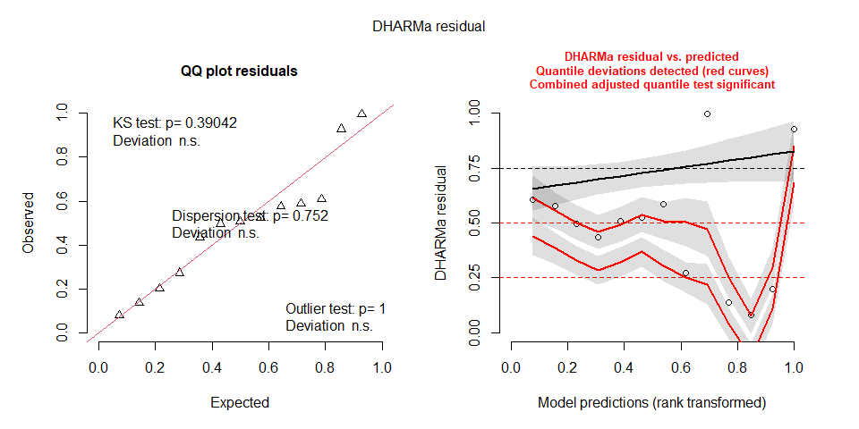
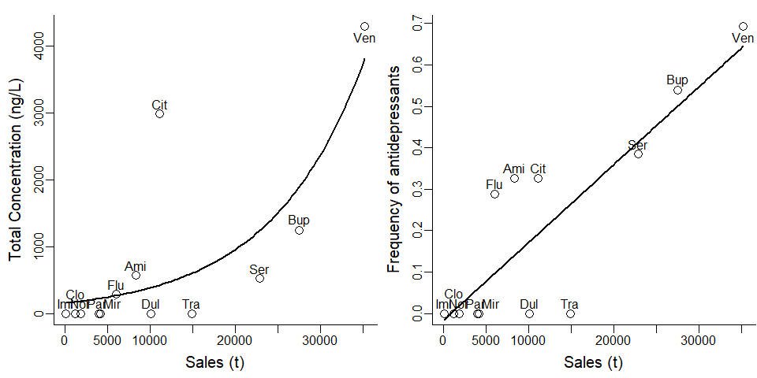

Influence of volume of sales on the contamination of streamwater by
antidepressants
================
Rodolfo Pelinson
2024-11-13

Necessary packages:

``` r
library(glmmTMB)
library(DHARMa)
library(AICcmodavg)
library(car)
```

Checking which of tweedie or gaussian distributions are better to model
antidepressant concentration.

``` r
mod_gaus <- glmmTMB(ng_L~kg, family = "gaussian", data = data_IQVIA_vs_encontrados)
mod_tw <- glmmTMB(ng_L~kg, family = "tweedie", data = data_IQVIA_vs_encontrados)

plot(simulateResiduals(mod_gaus))
```

<!-- -->

``` r
plot(simulateResiduals(mod_tw))
```

<!-- -->

``` r
AICc(mod_gaus)
```

    ## [1] 223.3172

``` r
AICc(mod_tw)
```

    ## [1] 124.2585

Checking if the best model (tweedie) is more plausible than a model
including only the intercept.

``` r
mod_tw0 <- glmmTMB(ng_L~1, family = "tweedie", data = data_IQVIA_vs_encontrados)

aictab(list(mod_tw0, mod_tw))
```

    ## 
    ## Model selection based on AICc:
    ## 
    ##      K   AICc Delta_AICc AICcWt Cum.Wt     LL
    ## Mod2 4 124.26       0.00   0.82   0.82 -55.63
    ## Mod1 3 127.30       3.04   0.18   1.00 -59.32

Same procedure for frequency of antidepressants:

``` r
mod_gaus <- glmmTMB(frequencia~kg, family = "gaussian", data = data_IQVIA_vs_encontrados)
mod_beta <- glmmTMB(frequencia~kg, family = ordbeta(link = "probit"), data = data_IQVIA_vs_encontrados, control = glmmTMBControl(optimizer = optim))

plot(simulateResiduals(mod_gaus))
```

<!-- -->

``` r
plot(simulateResiduals(mod_beta))
```

<!-- -->

``` r
AICc(mod_gaus)
```

    ## [1] -8.610147

``` r
AICc(mod_beta)
```

    ## [1] 18.0738

``` r
mod_gaus0 <- glmmTMB(frequencia~1, family = "gaussian", data = data_IQVIA_vs_encontrados)

aictab(list(mod_gaus0, mod_gaus))
```

    ## 
    ## Model selection based on AICc:
    ## 
    ##      K  AICc Delta_AICc AICcWt Cum.Wt   LL
    ## Mod2 3 -8.61       0.00      1      1 8.64
    ## Mod1 2  4.31      12.92      0      1 0.44

Now ploting these models:

``` r
new_data <- data.frame(kg = seq(min(data_IQVIA_vs_encontrados$kg), max(data_IQVIA_vs_encontrados$kg), length.out = 100))

predicted_ng_L <- predict(mod_tw, newdata = new_data, type = "response")

predicted_freq <- predict(mod_gaus, newdata = new_data, type = "response")


#pdf(paste(caminho, "Paper/Vendas_VS_Encontrado_pontos_nomes.pdf", sep = ""), width = 4, height = 3.5, pointsize = 7)

par(mfrow = c(1,2),mar = c(3.5,3.55,1,0.1), bty = "l")

plot(data_IQVIA_vs_encontrados$ng_L~data_IQVIA_vs_encontrados$kg , type = "n", xaxt = "n", yaxt = "n", xlab = "", ylab = "")

title(ylab = "Total Concentration (ng/L)", line = 2., cex.lab = 1.25)
title(xlab = "Sales (t)", line = 2, cex.lab = 1.25)
#title(ylab = "", line = 2, cex.lab = 1.25)

axis(1, tick = TRUE, line = 0, labels = FALSE); axis(1, tick = FALSE, cex.axis = 1, line = -0.5)
axis(2, tick = TRUE, line = 0, labels = FALSE); axis(2, tick = FALSE, cex.axis = 1, line = -0.5)

#polygon(x = c(0:100,100:0), y = c(predicted_lower,predicted_upper[101:1] ), col = "grey80", border = FALSE)
lines(new_data$kg, predicted_ng_L, lty = 1, lwd = 2)

points(data_IQVIA_vs_encontrados$kg, data_IQVIA_vs_encontrados$ng_L, pch = 1, cex = 1.5, col = "black", lwd = 2 *0.7)

labels <- substr(data_IQVIA_vs_encontrados$Antidepressant, 1, 3)

ycoord <- data_IQVIA_vs_encontrados$ng_L
ycoord[labels == "Clo"] <- ycoord[labels == "Clo"] + 150
ycoord[labels == "Ven"] <- ycoord[labels == "Ven"] - 300


xcoord <- data_IQVIA_vs_encontrados$kg
xcoord[labels == "Par"] <- xcoord[labels == "Par"] - 200
xcoord[labels == "Mir"] <- xcoord[labels == "Mir"] + 1400

text(xcoord, ycoord+150, labels = labels)


plot(data_IQVIA_vs_encontrados$frequencia~data_IQVIA_vs_encontrados$kg , type = "n", xaxt = "n", yaxt = "n", xlab = "", ylab = "")

title(ylab = "Frequency of antidepressants", line = 2., cex.lab = 1.25)
title(xlab = "Sales (t)", line = 2, cex.lab = 1.25)
#title(ylab = "", line = 2, cex.lab = 1.25)

axis(1, tick = TRUE, line = 0, labels = FALSE); axis(1, tick = FALSE, cex.axis = 1, line = -0.5)
axis(2, tick = TRUE, line = 0, labels = FALSE); axis(2, tick = FALSE, cex.axis = 1, line = -0.5)

#polygon(x = c(0:100,100:0), y = c(predicted_lower,predicted_upper[101:1] ), col = "grey80", border = FALSE)
lines(new_data$kg, predicted_freq, lty = 1, lwd = 2)

points(data_IQVIA_vs_encontrados$kg, data_IQVIA_vs_encontrados$frequencia, pch = 1, cex = 1.5, col = "black", lwd = 2 *0.7)

labels <- substr(data_IQVIA_vs_encontrados$Antidepressant, 1, 3)


ycoord <- data_IQVIA_vs_encontrados$frequencia
ycoord[labels == "Clo"] <- ycoord[labels == "Clo"] + 0.025
ycoord[labels == "Ven"] <- ycoord[labels == "Ven"] - 0.05


xcoord <- data_IQVIA_vs_encontrados$kg
xcoord[labels == "Par"] <- xcoord[labels == "Par"] - 200
xcoord[labels == "Mir"] <- xcoord[labels == "Mir"] + 1400

text(xcoord, ycoord+0.025, labels = labels)
```

<!-- -->

``` r
#dev.off()
```
