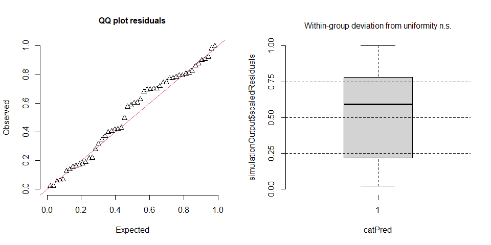
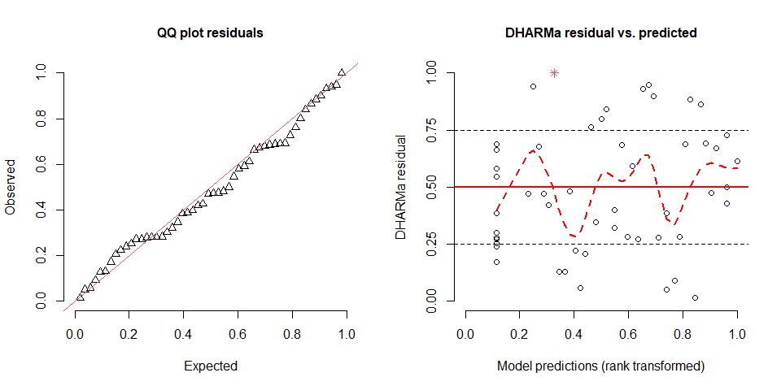
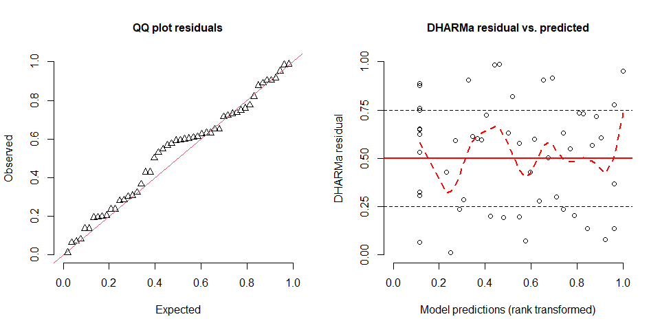
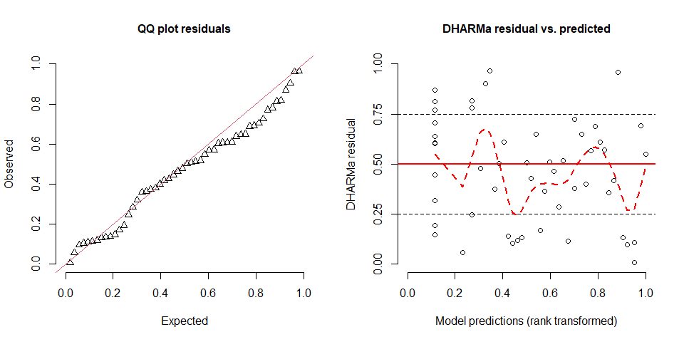

Concentration of molecules across the gradient in urban cover
================
Rodolfo Pelinson
2024-11-14

``` r
library(vegan)
library(shape)
library(scales)
library(AICcmodavg)
library(bbmle)
library(mgcv)
library(DHARMa)
```

Here we use a custom function that I made to fit several gam models with
different maximum numbers of k and than make model selection using AICc.
This function uses the gam function from mgcv package.

``` r
source("C:/Users/rodol/OneDrive/repos/Antidepressants_sp/scripts/functions/select_gam.R")

O.desmethylvenlafaxine_model <- select_gam(y = data_farmacos$O.desmethylvenlafaxine, x = data_farmacos$urb, family = "tw")
par(mfrow = c(1,2))
plotQQunif(simulateResiduals(O.desmethylvenlafaxine_model$best_model), testUniformity = FALSE, testOutliers = FALSE, testDispersion = FALSE)
plotResiduals(simulateResiduals(O.desmethylvenlafaxine_model$best_model), quantreg = FALSE, smoothScatter = FALSE, absoluteDeviation = FALSE)
```


``` r
O.desmethylvenlafaxine_model$AICTAB
```

    ##            dAICc       df
    ## gam_1  0.0000000 4.971650
    ## gam_3  0.8188150 5.897255
    ## gam_4  0.8309551 5.902092
    ## gam_2  0.9993552 5.708132
    ## gam_0 11.8326855 3.000000

``` r
Hydroxybupropion_model <- select_gam(y = data_farmacos$Hydroxybupropion, x = data_farmacos$urb, drop.intercept = FALSE, family = "tw")
plotQQunif(simulateResiduals(Hydroxybupropion_model$best_model), testUniformity = FALSE, testOutliers = FALSE, testDispersion = FALSE)
plotResiduals(simulateResiduals(Hydroxybupropion_model$best_model), quantreg = FALSE, smoothScatter = FALSE, absoluteDeviation = FALSE)
```


``` r
Hydroxybupropion_model$AICTAB
```

    ##              dAICc       df
    ## gam_3 0.0000000000 3.985762
    ## gam_4 0.0002795905 3.985907
    ## gam_2 0.0003035746 3.985920
    ## gam_1 0.0004842460 3.986002
    ## gam_0 5.5275188763 3.000000

``` r
Bupropion_model <- select_gam(y = data_farmacos$Bupropion, x = data_farmacos$urb, family = "tw")
plotQQunif(simulateResiduals(Bupropion_model$best_model), testUniformity = FALSE, testOutliers = FALSE, testDispersion = FALSE)
plotResiduals(simulateResiduals(Bupropion_model$best_model), quantreg = FALSE, smoothScatter = FALSE, absoluteDeviation = FALSE)
```



``` r
Bupropion_model$AICTAB
```

    ##              dAICc       df
    ## gam_0 0.0000000000 3.000000
    ## gam_2 0.0007142002 3.000513
    ## gam_3 0.0007478917 3.000537
    ## gam_4 0.0008935039 3.000641
    ## gam_1 0.0032908018 3.002521

``` r
Venlafaxine_model <- select_gam(y = data_farmacos$Venlafaxine, x = data_farmacos$urb, family = "tw")
plotQQunif(simulateResiduals(Venlafaxine_model$best_model), testUniformity = FALSE, testOutliers = FALSE, testDispersion = FALSE)
plotResiduals(simulateResiduals(Venlafaxine_model$best_model), quantreg = FALSE, smoothScatter = FALSE, absoluteDeviation = FALSE)
```


``` r
Venlafaxine_model$AICTAB
```

    ##           dAICc       df
    ## gam_1 0.0000000 4.668499
    ## gam_3 0.1345404 4.600296
    ## gam_4 0.1358352 4.601320
    ## gam_2 0.1399008 4.607200
    ## gam_0 9.0705145 3.000000

``` r
Desmethylcitalopram_model <- select_gam(y = data_farmacos$Desmethylcitalopram, x = data_farmacos$urb, family = "tw")
plotQQunif(simulateResiduals(Desmethylcitalopram_model$best_model), testUniformity = FALSE, testOutliers = FALSE, testDispersion = FALSE)
plotResiduals(simulateResiduals(Desmethylcitalopram_model$best_model), quantreg = FALSE, smoothScatter = FALSE, absoluteDeviation = FALSE)
```



``` r
Desmethylcitalopram_model$AICTAB
```

    ##              dAICc       df
    ## gam_3 0.000000e+00 3.987633
    ## gam_4 4.882549e-05 3.987655
    ## gam_2 1.988624e-04 3.987720
    ## gam_1 2.841676e-04 3.987756
    ## gam_0 6.361147e+00 3.000000

``` r
Citalopram_model <- select_gam(y = data_farmacos$Citalopram, x = data_farmacos$urb, family = "tw")
plotQQunif(simulateResiduals(Citalopram_model$best_model), testUniformity = FALSE, testOutliers = FALSE, testDispersion = FALSE)
plotResiduals(simulateResiduals(Citalopram_model$best_model), quantreg = FALSE, smoothScatter = FALSE, absoluteDeviation = FALSE)
```


``` r
Citalopram_model$AICTAB
```

    ##           dAICc       df
    ## gam_1 0.0000000 4.274569
    ## gam_2 0.5922851 4.856147
    ## gam_4 0.6251028 4.986482
    ## gam_3 0.6288800 4.989637
    ## gam_0 3.3779255 3.000000

``` r
Norfluoxetina_model <- select_gam(y = data_farmacos$Norfluoxetina, x = data_farmacos$urb, family = "tw")
plotQQunif(simulateResiduals(Norfluoxetina_model$best_model), testUniformity = FALSE, testOutliers = FALSE, testDispersion = FALSE)
plotResiduals(simulateResiduals(Norfluoxetina_model$best_model), quantreg = FALSE, smoothScatter = FALSE, absoluteDeviation = FALSE)
```


``` r
Norfluoxetina_model$AICTAB
```

    ##           dAICc       df
    ## gam_3 0.0000000 4.937273
    ## gam_0 0.8839997 3.000000
    ## gam_1 0.8840012 3.000004
    ## gam_4 0.8840210 3.000015
    ## gam_2 0.8840302 3.000022

``` r
Fluoxetine_model <- select_gam(y = data_farmacos$Fluoxetine, x = data_farmacos$urb, family = "tw")
plotQQunif(simulateResiduals(Fluoxetine_model$best_model), testUniformity = FALSE, testOutliers = FALSE, testDispersion = FALSE)
plotResiduals(simulateResiduals(Fluoxetine_model$best_model), quantreg = FALSE, smoothScatter = FALSE, absoluteDeviation = FALSE)
```


``` r
Fluoxetine_model$AICTAB
```

    ##          dAICc       df
    ## gam_1 0.000000 4.913659
    ## gam_2 1.021624 5.161286
    ## gam_3 1.053686 5.195265
    ## gam_4 1.057328 5.197056
    ## gam_0 5.991197 3.000000

``` r
Amitriptyline_model <- select_gam(y = data_farmacos$Amitriptyline, x = data_farmacos$urb, family = "tw")
plotQQunif(simulateResiduals(Amitriptyline_model$best_model), testUniformity = FALSE, testOutliers = FALSE, testDispersion = FALSE)
plotResiduals(simulateResiduals(Amitriptyline_model$best_model), quantreg = FALSE, smoothScatter = FALSE, absoluteDeviation = FALSE)
```



``` r
Amitriptyline_model$AICTAB
```

    ##           dAICc       df
    ## gam_1 0.0000000 4.830653
    ## gam_2 0.4433371 4.795867
    ## gam_3 0.4557376 4.790558
    ## gam_4 0.4557437 4.786905
    ## gam_0 7.6142452 3.000000

``` r
Trimipramine_model <- select_gam(y = data_farmacos$Trimipramine, x = data_farmacos$urb, family = "tw")
plotQQunif(simulateResiduals(Trimipramine_model$best_model), testUniformity = FALSE, testOutliers = FALSE, testDispersion = FALSE)
plotResiduals(simulateResiduals(Trimipramine_model$best_model), quantreg = FALSE, smoothScatter = FALSE, absoluteDeviation = FALSE)
```



``` r
Trimipramine_model$AICTAB
```

    ##           dAICc       df
    ## gam_1 0.0000000 3.913561
    ## gam_0 0.8372199 3.000000
    ## gam_2 0.8372201 3.000002
    ## gam_3 0.8372249 3.000005
    ## gam_4 0.8372276 3.000006

``` r
Sertraline_model <- select_gam(y = data_farmacos$Sertraline, x = data_farmacos$urb, family = "tw")
plotQQunif(simulateResiduals(Sertraline_model$best_model), testUniformity = FALSE, testOutliers = FALSE, testDispersion = FALSE)
plotResiduals(simulateResiduals(Sertraline_model$best_model), quantreg = FALSE, smoothScatter = FALSE, absoluteDeviation = FALSE)
```


``` r
Sertraline_model$AICTAB
```

    ##           dAICc       df
    ## gam_1  0.000000 4.958475
    ## gam_2  1.837308 5.466046
    ## gam_3  1.934482 5.515251
    ## gam_4  1.940906 5.519185
    ## gam_0 16.474183 3.000000

Our models generally fitted well within the chosen statistical
distribution (tweedie). With the exception of Trimipramine,
Norfluoxetine and Bupropion, all models including urban cover as a
predictor was considered by far more plausible than the model without
any effect of urban cover.

   

Ploting the best models:

``` r
ylab.cex <- 0.9
xlab.cex <- 0.9
axis.cex <- 0.75
line_labs <- 1.25
line_axis <- -0.75
tck <- -0.03
cex.points <- 0.7
line_lwd <- 1.25
cex.letter <- 1.25
x_letter = 5
y_letter = 98

O.desmethylvenlafaxine_plot <- function(letter = ""){
  plot(data_farmacos$O.desmethylvenlafaxine ~ data_farmacos$urb , type = "n", xaxt = "n", yaxt = "n", xlab = "", ylab = "")
  title(xlab = "Urban cover (%)", line = line_labs, cex.lab = xlab.cex)
  title(ylab = "O-desmethylvenlafaxine", line = 2, cex.lab = ylab.cex)
  title(ylab = "(ng/L)", line = 1.25, cex.lab = ylab.cex)
  polygon(y = c(O.desmethylvenlafaxine_model$estimates_best$lwr, O.desmethylvenlafaxine_model$estimates_best$upr[101:1]),
          x = c(0:100,100:0), col = "grey90", border = FALSE)
  abline(h = data_farmacos_reference$O.desmethylvenlafaxine, lty = 2, col = "brown")
  axis(1, tick = TRUE, line = 0, labels = FALSE,  tck = tck); axis(1, tick = FALSE, cex.axis = axis.cex, line = line_axis, gap.axis = -10)
  axis(2, tick = TRUE, line = 0, labels = FALSE,  tck = tck); axis(2, tick = FALSE, cex.axis = axis.cex, line = line_axis, gap.axis = -10)
  lines(c(0:100), O.desmethylvenlafaxine_model$estimates_best$fit, lty = 1, lwd  = line_lwd)
  points(x = data_farmacos$urb, y = data_farmacos$O.desmethylvenlafaxine, pch = 16, cex = cex.points)
  box()
  margins <- par()$mar
  par(new = TRUE, mar = c(0,0,0,0))
  plot(NA , type = "n", xaxt = "n", yaxt = "n", xlab = "", ylab = "", bty = "n", xlim = c(0,100), ylim = c(0,100))
  text(x = x_letter, y = y_letter, labels = letter, font = 2, cex = cex.letter, adj = 0)
  par(mar = margins)    
}


Hydroxybupropion_plot <- function(letter = ""){
  plot(data_farmacos$Hydroxybupropion ~ data_farmacos$urb , type = "n", xaxt = "n", yaxt = "n", xlab = "", ylab = "")
  title(xlab = "Urban cover (%)", line = line_labs, cex.lab = xlab.cex)
  title(ylab = "Hydroxybupropion", line = 2, cex.lab = ylab.cex)
  title(ylab = "(ng/L)", line = 1.25, cex.lab = ylab.cex)
  polygon(y = c(Hydroxybupropion_model$estimates_best$lwr, Hydroxybupropion_model$estimates_best$upr[101:1]),
          x = c(0:100,100:0), col = "grey90", border = FALSE)
  abline(h = data_farmacos_reference$Hydroxybupropion, lty = 2, col = "brown")
  axis(1, tick = TRUE, line = 0, labels = FALSE,  tck = tck); axis(1, tick = FALSE, cex.axis = axis.cex, line = line_axis, gap.axis = -10)
  axis(2, tick = TRUE, line = 0, labels = FALSE,  tck = tck); axis(2, tick = FALSE, cex.axis = axis.cex, line = line_axis, gap.axis = -10)
  lines(c(0:100), Hydroxybupropion_model$estimates_best$fit, lty = 1, lwd  = line_lwd)
  points(x = data_farmacos$urb, y = data_farmacos$Hydroxybupropion, pch = 16, cex = cex.points)
  box()
  margins <- par()$mar
  par(new = TRUE, mar = c(0,0,0,0))
  plot(NA , type = "n", xaxt = "n", yaxt = "n", xlab = "", ylab = "", bty = "n", xlim = c(0,100), ylim = c(0,100))
  text(x = x_letter, y = y_letter, labels = letter, font = 2, cex = cex.letter, adj = 0)
  par(mar = margins)  
}


Bupropion_plot <- function(letter = ""){
  plot(data_farmacos$Bupropion ~ data_farmacos$urb , type = "n", xaxt = "n", yaxt = "n", xlab = "", ylab = "")
  title(xlab = "Urban cover (%)", line = line_labs, cex.lab = xlab.cex)
  title(ylab = "Bupropion (ng/L)", line = line_labs, cex.lab = ylab.cex)
  
  #polygon(y = c(Bupropion_model$estimates_best$lwr, Bupropion_model$estimates_best$upr[101:1]),
  #        x = c(0:100,100:0), col = "grey90", border = FALSE)
  abline(h = data_farmacos_reference$Bupropion, lty = 2, col = "brown")
  axis(1, tick = TRUE, line = 0, labels = FALSE,  tck = tck); axis(1, tick = FALSE, cex.axis = axis.cex, line = line_axis, gap.axis = -10)
  axis(2, tick = TRUE, line = 0, labels = FALSE,  tck = tck); axis(2, tick = FALSE, cex.axis = axis.cex, line = line_axis, gap.axis = -10)
  #lines(c(0:100), Bupropion_model$estimates_best$fit, lty = 2, lwd  = line_lwd, col = "grey40")
  points(x = data_farmacos$urb, y = data_farmacos$Bupropion, pch = 16, cex = cex.points)
  margins <- par()$mar
  par(new = TRUE, mar = c(0,0,0,0))
  plot(NA , type = "n", xaxt = "n", yaxt = "n", xlab = "", ylab = "", bty = "n", xlim = c(0,100), ylim = c(0,100))
  text(x = x_letter, y = y_letter, labels = letter, font = 2, cex = cex.letter, adj = 0)
  par(mar = margins)    
}


Venlafaxine_plot <- function(letter = ""){
  plot(data_farmacos$Venlafaxine ~ data_farmacos$urb , type = "n", ylim = c(0,60), xaxt = "n", yaxt = "n", xlab = "", ylab = "")
  title(xlab = "Urban cover (%)", line = line_labs, cex.lab = xlab.cex)
  title(ylab = "Venlafaxine (ng/L)", line = line_labs, cex.lab = ylab.cex)
  
  polygon(y = c(Venlafaxine_model$estimates_best$lwr, Venlafaxine_model$estimates_best$upr[101:1]),
          x = c(0:100,100:0), col = "grey90", border = FALSE)
  abline(h = data_farmacos_reference$Venlafaxine, lty = 2, col = "brown")
  axis(1, tick = TRUE, line = 0, labels = FALSE,  tck = tck); axis(1, tick = FALSE, cex.axis = axis.cex, line = line_axis, gap.axis = -10)
  axis(2, tick = TRUE, line = 0, labels = FALSE,  tck = tck); axis(2, tick = FALSE, cex.axis = axis.cex, line = line_axis, gap.axis = -10)
  lines(c(0:100), Venlafaxine_model$estimates_best$fit, lty = 1, lwd  = line_lwd, col = "black")
  points(x = data_farmacos$urb, y = data_farmacos$Venlafaxine, pch = 16, cex = cex.points)
  margins <- par()$mar
  par(new = TRUE, mar = c(0,0,0,0))
  plot(NA , type = "n", xaxt = "n", yaxt = "n", xlab = "", ylab = "", bty = "n", xlim = c(0,100), ylim = c(0,100))
  text(x = x_letter, y = y_letter, labels = letter, font = 2, cex = cex.letter, adj = 0)
  par(mar = margins)  
}


Desmethylcitalopram_plot <- function(letter = ""){
  plot(data_farmacos$Desmethylcitalopram ~ data_farmacos$urb , type = "n", xaxt = "n", yaxt = "n", xlab = "", ylab = "")
  title(xlab = "Urban cover (%)", line = line_labs, cex.lab = xlab.cex)
  title(ylab = "Desmethylcitalopram", line = 2, cex.lab = ylab.cex)
  title(ylab = "(ng/L)", line = 1.25, cex.lab = ylab.cex)
  polygon(y = c(Desmethylcitalopram_model$estimates_best$lwr, Desmethylcitalopram_model$estimates_best$upr[101:1]),
          x = c(0:100,100:0), col = "grey90", border = FALSE)
  abline(h = data_farmacos_reference$Desmethylcitalopram, lty = 2, col = "brown")
  axis(1, tick = TRUE, line = 0, labels = FALSE,  tck = tck); axis(1, tick = FALSE, cex.axis = axis.cex, line = line_axis, gap.axis = -10)
  axis(2, tick = TRUE, line = 0, labels = FALSE,  tck = tck); axis(2, tick = FALSE, cex.axis = axis.cex, line = line_axis, gap.axis = -10)
  lines(c(0:100), Desmethylcitalopram_model$estimates_best$fit, lty = 1, lwd  = line_lwd, col = "black")
  points(x = data_farmacos$urb, y = data_farmacos$Desmethylcitalopram, pch = 16, cex = cex.points)
  box()
  margins <- par()$mar
  par(new = TRUE, mar = c(0,0,0,0))
  plot(NA , type = "n", xaxt = "n", yaxt = "n", xlab = "", ylab = "", bty = "n", xlim = c(0,100), ylim = c(0,100))
  text(x = x_letter, y = y_letter, labels = letter, font = 2, cex = cex.letter, adj = 0)
  par(mar = margins)  
}


Citalopram_plot <- function(letter = ""){
  plot(data_farmacos$Citalopram ~ data_farmacos$urb , type = "n", xaxt = "n", yaxt = "n", xlab = "", ylab = "")
  title(xlab = "Urban cover (%)", line = line_labs, cex.lab = xlab.cex)
  title(ylab = "Citalopram (ng/L)", line = line_labs, cex.lab = ylab.cex)
  
  polygon(y = c(Citalopram_model$estimates_best$lwr, Citalopram_model$estimates_best$upr[101:1]),
          x = c(0:100,100:0), col = "grey90", border = FALSE)
  abline(h = data_farmacos_reference$Citalopram, lty = 2, col = "brown")
  axis(1, tick = TRUE, line = 0, labels = FALSE,  tck = tck); axis(1, tick = FALSE, cex.axis = axis.cex, line = line_axis, gap.axis = -10)
  axis(2, tick = TRUE, line = 0, labels = FALSE,  tck = tck); axis(2, tick = FALSE, cex.axis = axis.cex, line = line_axis, gap.axis = -10)
  lines(c(0:100), Citalopram_model$estimates_best$fit, lty = 1, lwd  = line_lwd)
  points(x = data_farmacos$urb, y = data_farmacos$Citalopram, pch = 16, cex = cex.points)
  margins <- par()$mar
  par(new = TRUE, mar = c(0,0,0,0))
  plot(NA , type = "n", xaxt = "n", yaxt = "n", xlab = "", ylab = "", bty = "n", xlim = c(0,100), ylim = c(0,100))
  text(x = x_letter, y = y_letter, labels = letter, font = 2, cex = cex.letter, adj = 0)
  par(mar = margins)  
}


Norfluoxetina_plot <- function(letter = ""){
  plot(data_farmacos$Norfluoxetina ~ data_farmacos$urb , type = "n", xaxt = "n", yaxt = "n", xlab = "", ylab = "")
  title(xlab = "Urban cover (%)", line = line_labs, cex.lab = xlab.cex)
  title(ylab = "Norfluoxetina (ng/L)", line = line_labs, cex.lab = ylab.cex)
  
  #polygon(y = c(Norfluoxetina_model$estimates_second$lwr, Norfluoxetina_model$estimates_second$upr[101:1]),
  #        x = c(0:100,100:0), col = "grey90", border = FALSE)
  abline(h = data_farmacos_reference$Norfluoxetina, lty = 2, col = "brown") #LQ Talvez esteja errado
  axis(1, tick = TRUE, line = 0, labels = FALSE,  tck = tck); axis(1, tick = FALSE, cex.axis = axis.cex, line = line_axis, gap.axis = -10)
  axis(2, tick = TRUE, line = 0, labels = FALSE,  tck = tck); axis(2, tick = FALSE, cex.axis = axis.cex, line = line_axis, gap.axis = -10)
  #lines(c(0:100), Norfluoxetina_model$estimates_second$fit, lty = 2, lwd  = line_lwd, col = "grey40")
  points(x = data_farmacos$urb, y = data_farmacos$Norfluoxetina, pch = 16, cex = cex.points)
  margins <- par()$mar
  par(new = TRUE, mar = c(0,0,0,0))
  plot(NA , type = "n", xaxt = "n", yaxt = "n", xlab = "", ylab = "", bty = "n", xlim = c(0,100), ylim = c(0,100))
  text(x = x_letter, y = y_letter, labels = letter, font = 2, cex = cex.letter, adj = 0)
  par(mar = margins)  
}


Fluoxetine_plot <- function(letter = ""){
  plot(data_farmacos$Fluoxetine ~ data_farmacos$urb , type = "n", xaxt = "n", yaxt = "n", xlab = "", ylab = "")
  title(xlab = "Urban cover (%)", line = line_labs, cex.lab = xlab.cex)
  title(ylab = "Fluoxetine (ng/L)", line = line_labs, cex.lab = ylab.cex)
  
  polygon(y = c(Fluoxetine_model$estimates_best$lwr, Fluoxetine_model$estimates_best$upr[101:1]),
          x = c(0:100,100:0), col = "grey90", border = FALSE)
  abline(h = data_farmacos_reference$Fluoxetine, lty = 2, col = "brown") #LQ Talvez esteja errado
  axis(1, tick = TRUE, line = 0, labels = FALSE,  tck = tck); axis(1, tick = FALSE, cex.axis = axis.cex, line = line_axis, gap.axis = -10)
  axis(2, tick = TRUE, line = 0, labels = FALSE,  tck = tck); axis(2, tick = FALSE, cex.axis = axis.cex, line = line_axis, gap.axis = -10)
  lines(c(0:100), Fluoxetine_model$estimates_best$fit, lty = 1, lwd  = line_lwd)
  points(x = data_farmacos$urb, y = data_farmacos$Fluoxetine, pch = 16, cex = cex.points)
  margins <- par()$mar
  par(new = TRUE, mar = c(0,0,0,0))
  plot(NA , type = "n", xaxt = "n", yaxt = "n", xlab = "", ylab = "", bty = "n", xlim = c(0,100), ylim = c(0,100))
  text(x = x_letter, y = y_letter, labels = letter, font = 2, cex = cex.letter, adj = 0)
  par(mar = margins)
}


Amitriptyline_plot <- function(letter = ""){
  plot(data_farmacos$Amitriptyline ~ data_farmacos$urb , type = "n", xaxt = "n", yaxt = "n", xlab = "", ylab = "")
  title(xlab = "Urban cover (%)", line = line_labs, cex.lab = xlab.cex)
  title(ylab = "Amitriptyline (ng/L)", line = line_labs, cex.lab = ylab.cex)
  
  polygon(y = c(Amitriptyline_model$estimates_best$lwr, Amitriptyline_model$estimates_best$upr[101:1]),
          x = c(0:100,100:0), col = "grey90", border = FALSE)
  abline(h = data_farmacos_reference$Amitriptyline, lty = 2, col = "brown") #LQ Talvez esteja errado
  axis(1, tick = TRUE, line = 0, labels = FALSE,  tck = tck); axis(1, tick = FALSE, cex.axis = axis.cex, line = line_axis, gap.axis = -10)
  axis(2, tick = TRUE, line = 0, labels = FALSE,  tck = tck); axis(2, tick = FALSE, cex.axis = axis.cex, line = line_axis, gap.axis = -10)
  lines(c(0:100), Amitriptyline_model$estimates_best$fit, lty = 1, lwd  = line_lwd)
  points(x = data_farmacos$urb, y = data_farmacos$Amitriptyline, pch = 16, cex = cex.points)
  margins <- par()$mar
  par(new = TRUE, mar = c(0,0,0,0))
  plot(NA , type = "n", xaxt = "n", yaxt = "n", xlab = "", ylab = "", bty = "n", xlim = c(0,100), ylim = c(0,100))
  text(x = x_letter, y = y_letter, labels = letter, font = 2, cex = cex.letter, adj = 0)
  par(mar = margins)
}


Trimipramine_plot <- function(letter = ""){
  plot(data_farmacos$Trimipramine ~ data_farmacos$urb , type = "n", xaxt = "n", yaxt = "n", xlab = "", ylab = "")
  title(xlab = "Urban cover (%)", line = line_labs, cex.lab = xlab.cex)
  title(ylab = "Trimipramine (ng/L)", line = line_labs, cex.lab = ylab.cex)
  
  #polygon(y = c(Trimipramine_model$estimates_best$lwr, Trimipramine_model$estimates_best$upr[101:1]),
  #        x = c(0:100,100:0), col = "grey90", border = FALSE)
  abline(h = data_farmacos_reference$Trimipramine, lty = 2, col = "brown") #LQ Talvez esteja errado
  axis(1, tick = TRUE, line = 0, labels = FALSE,  tck = tck); axis(1, tick = FALSE, cex.axis = axis.cex, line = -0.5, gap.axis = -10)
  axis(2, tick = TRUE, line = 0, labels = FALSE,  tck = tck); axis(2, tick = FALSE, cex.axis = axis.cex, line = -0.5, gap.axis = -10)
  #lines(c(0:100), Trimipramine_model$estimates_best$fit, lty = 1, lwd  = line_lwd, col = "black")
  points(x = data_farmacos$urb, y = data_farmacos$Trimipramine, pch = 16, cex = cex.points)
  margins <- par()$mar
  par(new = TRUE, mar = c(0,0,0,0))
  plot(NA , type = "n", xaxt = "n", yaxt = "n", xlab = "", ylab = "", bty = "n", xlim = c(0,100), ylim = c(0,100))
  text(x = x_letter, y = y_letter, labels = letter, font = 2, cex = cex.letter, adj = 0)
  par(mar = margins)
}

Sertraline_plot <- function(letter = ""){
  plot(data_farmacos$Sertraline ~ data_farmacos$urb , type = "n", xaxt = "n", yaxt = "n", xlab = "", ylab = "")
  title(xlab = "Urban cover (%)", line = line_labs, cex.lab = xlab.cex)
  title(ylab = "Sertraline (ng/L)", line = line_labs, cex.lab = ylab.cex)
  
  polygon(y = c(Sertraline_model$estimates_best$lwr, Sertraline_model$estimates_best$upr[101:1]),
          x = c(0:100,100:0), col = "grey90", border = FALSE)
  abline(h = data_farmacos_reference$Sertraline, lty = 2, col = "brown") #LQ Talvez esteja errado
  axis(1, tick = TRUE, line = 0, labels = FALSE,  tck = tck); axis(1, tick = FALSE, cex.axis = axis.cex, line = -0.5, gap.axis = -10)
  axis(2, tick = TRUE, line = 0, labels = FALSE,  tck = tck); axis(2, tick = FALSE, cex.axis = axis.cex, line = -0.5, gap.axis = -10)
  lines(c(0:100), Sertraline_model$estimates_best$fit, lty = 1, lwd  = line_lwd)
  points(x = data_farmacos$urb, y = data_farmacos$Sertraline, pch = 16, cex = cex.points)
  margins <- par()$mar
  par(new = TRUE, mar = c(0,0,0,0))
  plot(NA , type = "n", xaxt = "n", yaxt = "n", xlab = "", ylab = "", bty = "n", xlim = c(0,100), ylim = c(0,100))
  text(x = x_letter, y = y_letter, labels = letter, font = 2, cex = 1.5, adj = 0)
  par(mar = margins)}


par(mfrow = c(6,2), mar = c(2.5,3.5,1.2,0.25))

Venlafaxine_plot(letter = "A)")
O.desmethylvenlafaxine_plot(letter = "B)")
Citalopram_plot(letter = "C)")
Desmethylcitalopram_plot(letter = "D)")
Bupropion_plot(letter = "E)")
Hydroxybupropion_plot(letter = "F)")
Amitriptyline_plot(letter = "G)")
Sertraline_plot(letter = "H)")
Fluoxetine_plot(letter = "I)")
Trimipramine_plot(letter = "J)")
Norfluoxetina_plot(letter = "K)")
```


