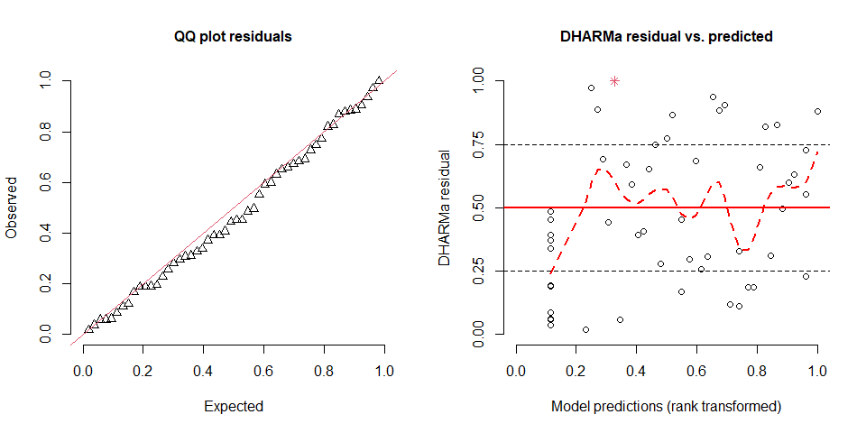
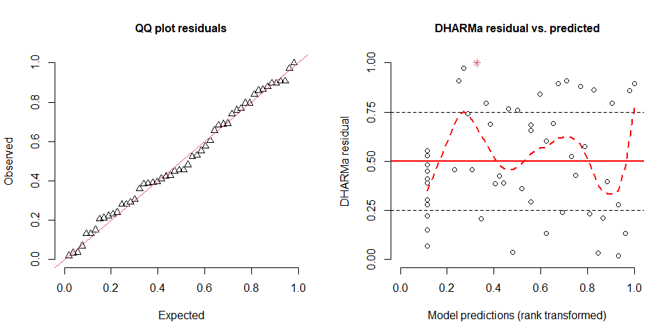
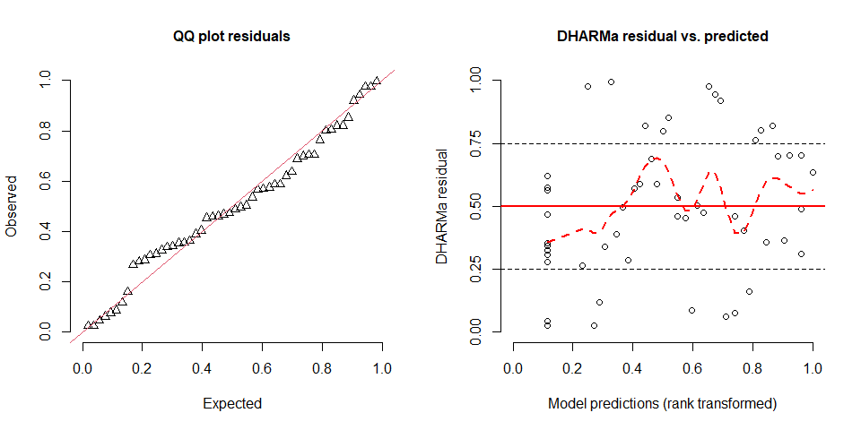
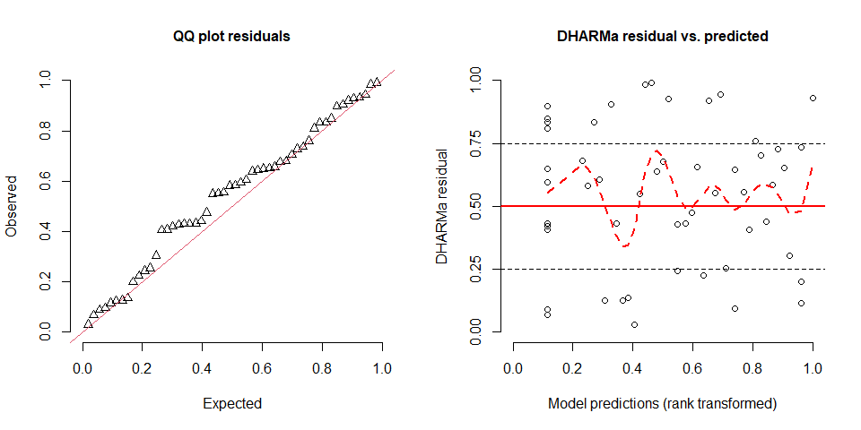
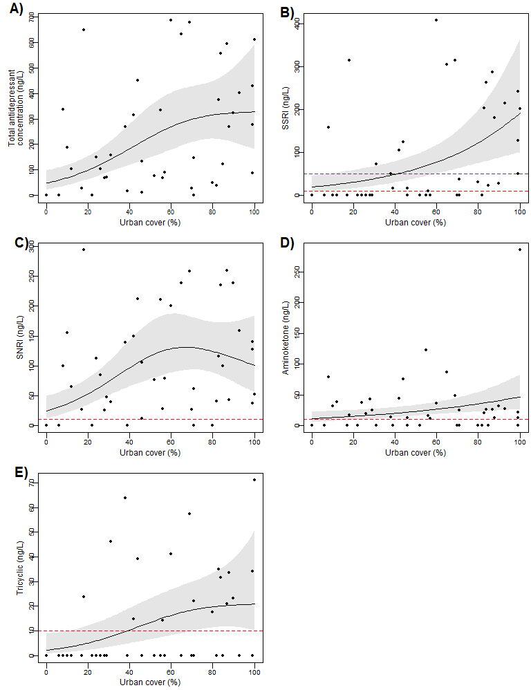

Concentration of molecules by class across the gradient in urban cover
================
Rodolfo Pelinson
2024-11-13

``` r
library(vegan)
library(shape)
library(scales)
library(AICcmodavg)
library(bbmle)
library(mgcv)
library(DHARMa)
```

Here we use a custom function that I made to fit several gam models with
different maximum numbers of k and than make model selection using AICc.
This function uses the gam function from mgcv package.

``` r
source("C:/Users/rodol/OneDrive/repos/Antidepressants_sp/scripts/functions/select_gam.R")

all_model <- select_gam(y = data_farmacos_by_class$all, x = data_farmacos_by_class$urb, drop.intercept = FALSE, family = "tw")
par(mfrow = c(1,2))
plotQQunif(simulateResiduals(all_model$best_model), testUniformity = FALSE, testOutliers = FALSE, testDispersion = FALSE)
plotResiduals(simulateResiduals(all_model$best_model), quantreg = FALSE, smoothScatter = FALSE, absoluteDeviation = FALSE)
```



``` r
all_model$AICTAB
```

    ##            dAICc       df
    ## gam_1  0.0000000 4.934877
    ## gam_3  0.7151645 5.383505
    ## gam_4  0.7203470 5.384592
    ## gam_2  0.7206512 5.335777
    ## gam_0 14.8968302 3.000000

``` r
SNRI_model <- select_gam(y = data_farmacos_by_class$SNRI, x = data_farmacos_by_class$urb, drop.intercept = FALSE, family = "tw")
plotQQunif(simulateResiduals(SNRI_model$best_model), testUniformity = FALSE, testOutliers = FALSE, testDispersion = FALSE)
plotResiduals(simulateResiduals(SNRI_model$best_model), quantreg = FALSE, smoothScatter = FALSE, absoluteDeviation = FALSE)
```



``` r
SNRI_model$AICTAB
```

    ##           dAICc       df
    ## gam_1  0.000000 4.971406
    ## gam_3  0.847510 5.855211
    ## gam_4  0.858759 5.859625
    ## gam_2  0.984332 5.689185
    ## gam_0 12.336915 3.000000

``` r
SSRI_model <- select_gam(y = data_farmacos_by_class$SSRI, x = data_farmacos_by_class$urb, drop.intercept = FALSE, family = "tw")
plotQQunif(simulateResiduals(SSRI_model$best_model), testUniformity = FALSE, testOutliers = FALSE, testDispersion = FALSE)
plotResiduals(simulateResiduals(SSRI_model$best_model), quantreg = FALSE, smoothScatter = FALSE, absoluteDeviation = FALSE)
```



``` r
SSRI_model$AICTAB
```

    ##              dAICc       df
    ## gam_2 0.000000e+00 3.996361
    ## gam_3 9.318455e-05 3.996417
    ## gam_4 1.664282e-04 3.996462
    ## gam_1 5.799568e-03 4.000204
    ## gam_0 1.033666e+01 3.000000

``` r
Aminoketone_model <- select_gam(y = data_farmacos_by_class$Aminoketone, x = data_farmacos_by_class$urb, drop.intercept = FALSE, family = "tw")
plotQQunif(simulateResiduals(Aminoketone_model$best_model), testUniformity = FALSE, testOutliers = FALSE, testDispersion = FALSE)
plotResiduals(simulateResiduals(Aminoketone_model$best_model), quantreg = FALSE, smoothScatter = FALSE, absoluteDeviation = FALSE)
```


``` r
Aminoketone_model$AICTAB
```

    ##              dAICc       df
    ## gam_3 0.000000e+00 3.986598
    ## gam_2 2.582694e-05 3.986612
    ## gam_1 1.068387e-04 3.986655
    ## gam_4 5.059569e-04 3.986877
    ## gam_0 5.745772e+00 3.000000

``` r
Tricyclic_model <- select_gam(y = data_farmacos_by_class$Tricyclic, x = data_farmacos_by_class$urb, drop.intercept = FALSE, family = "tw")
plotQQunif(simulateResiduals(Tricyclic_model$best_model), testUniformity = FALSE, testOutliers = FALSE, testDispersion = FALSE)
plotResiduals(simulateResiduals(Tricyclic_model$best_model), quantreg = FALSE, smoothScatter = FALSE, absoluteDeviation = FALSE)
```



``` r
Tricyclic_model$AICTAB
```

    ##           dAICc       df
    ## gam_1 0.0000000 4.861973
    ## gam_2 0.5781168 4.919037
    ## gam_3 0.6025203 4.916492
    ## gam_4 0.6043680 4.913566
    ## gam_0 7.1729546 3.000000

Our models generally fitted well within the chosen statistical
distribution (tweedie). Residuals sometimes exhibited somewhat lower
values for low fitted values for the total concentration of
antidepressants, which might indicate that there might be other
important predictors to the number of antidepressants found in
streamwater. Still, all models including urban cover as a predictor was
considered by far more plausible than the model without any effect of
urban cover.

   

Ploting the best models:

``` r
ylab.cex <- 0.9
xlab.cex <- 0.9
axis.cex <- 0.75
line_labs <- 1.25
line_axis <- -0.75
tck <- -0.03
cex.points <- 0.7
line_lwd <- 1.25
cex.letter <- 1.25
x_letter = 2
y_letter = 98


all_plot <- function(letter = "",  x_letter = 0, y_letter = 100 ){
  plot(data_farmacos_by_class$all ~ data_farmacos_by_class$urb , type = "n", xaxt = "n", yaxt = "n", xlab = "", ylab = "")
  title(xlab = "Urban cover (%)", line = line_labs, cex.lab = xlab.cex)
  title(ylab = "Total antidepressant", line = 2, cex.lab = ylab.cex)
  title(ylab = "concentration (ng/L)", line = 1.25, cex.lab = ylab.cex)

  polygon(y = c(all_model$estimates_best$lwr, all_model$estimates_best$upr[101:1]),
          x = c(0:100,100:0), col = "grey90", border = FALSE)
  abline(h = LQ$all, lty = 2, col = "brown")
  axis(1, tick = TRUE, line = 0, labels = FALSE,  tck = tck); axis(1, tick = FALSE, cex.axis = 0.7, line = line_axis, gap.axis = -10)
  axis(2, tick = TRUE, line = 0, labels = FALSE,  tck = tck); axis(2, tick = FALSE, cex.axis = 0.7, line = line_axis, gap.axis = -10)
  lines(c(0:100), all_model$estimates_best$fit, lty = 1, lwd  = line_lwd)
  points(x = data_farmacos_by_class$urb, y = data_farmacos_by_class$all, pch = 16, cex = cex.points)
  box()
  margins <- par()$mar
  par(new = TRUE, mar = c(0,0,0,0))
  plot(NA , type = "n", xaxt = "n", yaxt = "n", xlab = "", ylab = "", bty = "n", xlim = c(0,100), ylim = c(0,100))
  text(x = x_letter, y = y_letter, labels = letter, font = 2, cex = 1.5, adj = 0)
  par(mar = margins)
}


SNRI_plot <- function(letter = ""){
  plot(data_farmacos_by_class$SNRI ~ data_farmacos_by_class$urb , type = "n", xaxt = "n", yaxt = "n", xlab = "", ylab = "")
  title(xlab = "Urban cover (%)", line = line_labs, cex.lab = xlab.cex)
  title(ylab = "SNRI (ng/L)", line = line_labs, cex.lab = ylab.cex)
  
  polygon(y = c(SNRI_model$estimates_best$lwr, SNRI_model$estimates_best$upr[101:1]),
          x = c(0:100,100:0), col = "grey90", border = FALSE)
  abline(h = LQ$SNRI, lty = 2, col = "brown")
  axis(1, tick = TRUE, line = 0, labels = FALSE,  tck = tck); axis(1, tick = FALSE, cex.axis = axis.cex, line = line_axis, gap.axis = -10)
  axis(2, tick = TRUE, line = 0, labels = FALSE,  tck = tck); axis(2, tick = FALSE, cex.axis = axis.cex, line = line_axis, gap.axis = -10)
  lines(c(0:100), SNRI_model$estimates_best$fit, lty = 1, lwd  = line_lwd)
  points(x = data_farmacos_by_class$urb, y = data_farmacos_by_class$SNRI, pch = 16, cex = cex.points)
  box()
  margins <- par()$mar
  par(new = TRUE, mar = c(0,0,0,0))
  plot(NA , type = "n", xaxt = "n", yaxt = "n", xlab = "", ylab = "", bty = "n", xlim = c(0,100), ylim = c(0,100))
  text(x = x_letter, y = y_letter, labels = letter, font = 2, cex = 1.5, adj = 0)
  par(mar = margins)
}


SSRI_plot <- function(letter = ""){
  plot(data_farmacos_by_class$SSRI ~ data_farmacos_by_class$urb , type = "n", xaxt = "n", yaxt = "n", xlab = "", ylab = "")
  title(xlab = "Urban cover (%)", line = line_labs, cex.lab = xlab.cex)
  title(ylab = "SSRI (ng/L)", line = line_labs, cex.lab = ylab.cex)
  
  polygon(y = c(SSRI_model$estimates_best$lwr, SSRI_model$estimates_best$upr[101:1]),
          x = c(0:100,100:0), col = "grey90", border = FALSE)
  abline(h = LQ$SSRI, lty = 2, col = "brown")
  axis(1, tick = TRUE, line = 0, labels = FALSE,  tck = tck); axis(1, tick = FALSE, cex.axis = axis.cex, line = line_axis, gap.axis = -10)
  axis(2, tick = TRUE, line = 0, labels = FALSE,  tck = tck); axis(2, tick = FALSE, cex.axis = axis.cex, line = line_axis, gap.axis = -10)
  lines(c(0:100), SSRI_model$estimates_best$fit, lty = 1, lwd  = line_lwd)
  points(x = data_farmacos_by_class$urb, y = data_farmacos_by_class$SSRI, pch = 16, cex = cex.points)
  box()
  margins <- par()$mar
  par(new = TRUE, mar = c(0,0,0,0))
  plot(NA , type = "n", xaxt = "n", yaxt = "n", xlab = "", ylab = "", bty = "n", xlim = c(0,100), ylim = c(0,100))
  text(x = x_letter, y = y_letter, labels = letter, font = 2, cex = 1.5, adj = 0)
  par(mar = margins)
  
}


Aminoketone_plot <- function(letter = ""){
  plot(data_farmacos_by_class$Aminoketone ~ data_farmacos_by_class$urb , type = "n", xaxt = "n", yaxt = "n", xlab = "", ylab = "")
  title(xlab = "Urban cover (%)", line = line_labs, cex.lab = xlab.cex)
  title(ylab = "Aminoketone (ng/L)", line = line_labs, cex.lab = ylab.cex)
  
  polygon(y = c(Aminoketone_model$estimates_second$lwr, Aminoketone_model$estimates_second$upr[101:1]),
          x = c(0:100,100:0), col = "grey90", border = FALSE)
  abline(h = LQ$Aminoketone, lty = 2, col = "brown")
  axis(1, tick = TRUE, line = 0, labels = FALSE,  tck = tck); axis(1, tick = FALSE, cex.axis = axis.cex, line = line_axis, gap.axis = -10)
  axis(2, tick = TRUE, line = 0, labels = FALSE,  tck = tck); axis(2, tick = FALSE, cex.axis = axis.cex, line = line_axis, gap.axis = -10)
  lines(c(0:100), Aminoketone_model$estimates_best$fit, lty = 1, lwd  = line_lwd)
  points(x = data_farmacos_by_class$urb, y = data_farmacos_by_class$Aminoketone, pch = 16, cex = cex.points)
  box()
  margins <- par()$mar
  par(new = TRUE, mar = c(0,0,0,0))
  plot(NA , type = "n", xaxt = "n", yaxt = "n", xlab = "", ylab = "", bty = "n", xlim = c(0,100), ylim = c(0,100))
  text(x = x_letter, y = y_letter, labels = letter, font = 2, cex = 1.5, adj = 0)
  par(mar = margins)
  
}


Tricyclic_plot <- function(letter = ""){
  plot(data_farmacos_by_class$Tricyclic ~ data_farmacos_by_class$urb , type = "n", xaxt = "n", yaxt = "n", xlab = "", ylab = "")
  title(xlab = "Urban cover (%)", line = line_labs, cex.lab = xlab.cex)
  title(ylab = "Tricyclic (ng/L)", line = line_labs, cex.lab = ylab.cex)
  
  polygon(y = c(Tricyclic_model$estimates_second$lwr, Tricyclic_model$estimates_second$upr[101:1]),
          x = c(0:100,100:0), col = "grey90", border = FALSE)
  abline(h = LQ$Tricyclic, lty = 2, col = "brown")
  axis(1, tick = TRUE, line = 0, labels = FALSE,  tck = tck); axis(1, tick = FALSE, cex.axis = axis.cex, line = line_axis, gap.axis = -10)
  axis(2, tick = TRUE, line = 0, labels = FALSE,  tck = tck); axis(2, tick = FALSE, cex.axis = axis.cex, line = line_axis, gap.axis = -10)
  lines(c(0:100), Tricyclic_model$estimates_best$fit, lty = 1, lwd  = line_lwd)
  points(x = data_farmacos_by_class$urb, y = data_farmacos_by_class$Tricyclic, pch = 16, cex = cex.points)
  box()
  margins <- par()$mar
  par(new = TRUE, mar = c(0,0,0,0))
  plot(NA , type = "n", xaxt = "n", yaxt = "n", xlab = "", ylab = "", bty = "n", xlim = c(0,100), ylim = c(0,100))
  text(x = x_letter, y = y_letter, labels = letter, font = 2, cex = 1.5, adj = 0)
  par(mar = margins)
}


par(mfrow = c(3,2), mar = c(2.5,3.5,1.2,0.25))

all_plot(letter = "A)")
SSRI_plot(letter = "B)")
SNRI_plot(letter = "C)")
Aminoketone_plot(letter = "D)")
Tricyclic_plot(letter = "E)")
```


