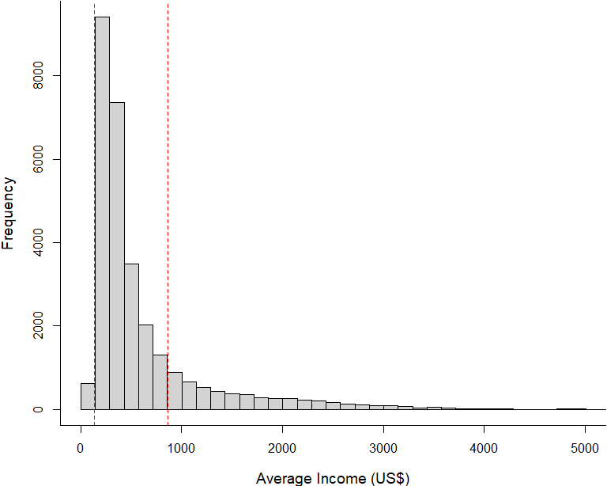

Histogram
================
Rodolfo Pelinson
2024-11-15

Checking the vectors:

``` r
head(inhabitants)
```

    ## [1] 800 913 625 572 754 643

``` r
head(income)
```

    ## [1] 903817 846525 505662 446011 615215 507028

``` r
length(inhabitants)
```

    ## [1] 29943

``` r
length(income)
```

    ## [1] 29943

transforming income into per capita income and changing the currency to
dollars.

``` r
dolar <- 1.7485

income_per_capita <- na.omit(income/inhabitants)

income_per_capita <- income_per_capita/dolar
```

Plotting:

``` r
par(mar = c(4,4,0.1,0.1), cex.lab = 1.2)
hist(income_per_capita, breaks = seq(from = 0, to = 26500/1.7485, by = 250/1.7485), xlim = c(0,5000), xlab = "Average Income (US$)", main = "", lwd = 0.5)
abline(v = min(predictors$renda)/dolar, lty = 2, col = "red", lwd = 1)
abline(v = max(predictors$renda)/dolar, lty = 2, col = "red", lwd = 1)
box(bty = "l")
```


