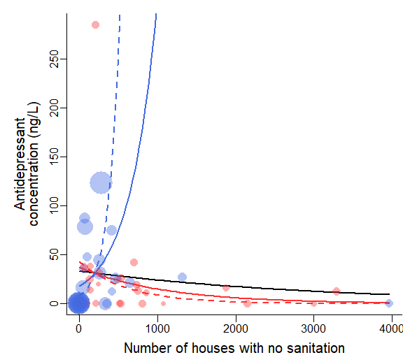

Predictors of total concentration of Aminoketone antidepressants in
streamwater
================
Rodolfo Pelinson
2024-11-15

Packages:

``` r
library(DHARMa)
library(AICcmodavg)
library(corrplot)
library(MuMIn)
library(vegan)
library(car)
library(lme4)
library(glmmTMB)
library(dplyr)
```

A few necessary functions to make the code more straightforward:

``` r
source("C:/Users/rodol/OneDrive/repos/Antidepressants_sp/scripts/functions/plot_models_one_var.R")
source("C:/Users/rodol/OneDrive/repos/Antidepressants_sp/scripts/functions/plot_models_two_var.R")
source("C:/Users/rodol/OneDrive/repos/Antidepressants_sp/scripts/functions/confidence_interval.R")
```

Performing the model selection procedure. Note that the name of the
variables are in portuguese.

Habitantes mean inhabitants casas_sem_saneamento means houses without
sanitation renda means income.

First we make a matrix to check which pairs of variables are correlated
(more than 50%) and therefore should not be together in the same model.

``` r
source("C:/Users/rodol/OneDrive/repos/Antidepressants_sp/scripts/ajeitando_planilhas.R")

pred_mod_sel <- select(predictors,  casas_sem_saneamento, renda, habitantes)

#Standardizing response variables
Preditoras_stand <- decostand(pred_mod_sel, method = "stand")

smat <- abs(cor(Preditoras_stand)) <= .5
smat[!lower.tri(smat)] <- NA

colnames(smat) <- c(paste("cond(",colnames(smat)[1], ")", sep = ""),
                    paste("cond(",colnames(smat)[2], ")", sep = ""),
                    paste("cond(",colnames(smat)[3], ")", sep = ""))

rownames(smat) <- colnames(smat)

cor(Preditoras_stand)
```

    ##                      casas_sem_saneamento      renda habitantes
    ## casas_sem_saneamento            1.0000000 -0.3425484  0.5866546
    ## renda                          -0.3425484  1.0000000 -0.2328670
    ## habitantes                      0.5866546 -0.2328670  1.0000000

``` r
smat
```

    ##                            cond(casas_sem_saneamento) cond(renda)
    ## cond(casas_sem_saneamento)                         NA          NA
    ## cond(renda)                                      TRUE          NA
    ## cond(habitantes)                                FALSE        TRUE
    ##                            cond(habitantes)
    ## cond(casas_sem_saneamento)               NA
    ## cond(renda)                              NA
    ## cond(habitantes)                         NA

Now performing the model selection.

``` r
Preditoras_stand$Aminoketone <- responses$Aminoketone

mod_global_Aminoketone <- glmmTMB(Aminoketone ~ 
                            #area +
                            casas_sem_saneamento +
                            habitantes +
                            renda + 
                            casas_sem_saneamento:renda+
                            #casas_sem_saneamento:renda:area+
                            habitantes:renda,
                            #habitantes:renda:area+
                            #casas_sem_saneamento:area+
                            #habitantes:area+
                            #renda:area,
                          data = Preditoras_stand, family = tweedie(link = "log"), na.action = "na.fail")


dredge_modelos_Aminoketone <- MuMIn::dredge(mod_global_Aminoketone, subset = smat)
```

    ## Fixed terms are "cond((Int))" and "disp((Int))"

``` r
models <- get.models(dredge_modelos_Aminoketone, subset = delta < 2)

aictab(models)
```

    ## 
    ## Model selection based on AICc:
    ## 
    ##    K   AICc Delta_AICc AICcWt Cum.Wt      LL
    ## 14 6 334.76          0      1      1 -160.42

``` r
dredge_modelos_Aminoketone
```

    ## Global model call: glmmTMB(formula = Aminoketone ~ casas_sem_saneamento + habitantes + 
    ##     renda + casas_sem_saneamento:renda + habitantes:renda, data = Preditoras_stand, 
    ##     family = tweedie(link = "log"), na.action = "na.fail", ziformula = ~0, 
    ##     dispformula = ~1)
    ## ---
    ## Model selection table 
    ##    cnd((Int)) dsp((Int)) cnd(css_sem_snm) cnd(hbt)  cnd(rnd)
    ## 14      3.919          +           1.1690           1.293000
    ## 2       3.131          +          -0.4322                   
    ## 1       3.196          +                                    
    ## 3       3.166          +                    0.2366          
    ## 23      3.253          +                    0.3789  0.157200
    ## 6       3.126          +          -0.4758          -0.097900
    ## 5       3.196          +                            0.006471
    ## 7       3.165          +                    0.2463  0.055450
    ##    cnd(css_sem_snm:rnd) cnd(hbt:rnd) df   logLik  AICc delta weight
    ## 14                3.194               6 -160.423 334.8  0.00  0.891
    ## 2                                     4 -166.347 341.6  6.81  0.030
    ## 1                                     3 -167.665 341.8  7.08  0.026
    ## 3                                     4 -166.875 342.6  7.86  0.017
    ## 23                             0.711  6 -164.667 343.2  8.49  0.013
    ## 6                                     5 -166.225 343.8  9.03  0.010
    ## 5                                     4 -167.664 344.2  9.44  0.008
    ## 7                                     5 -166.837 345.0 10.25  0.005
    ## Models ranked by AICc(x)

Selected models include houses without sanitaiton in interaction with
income.

Plotting the best models:

``` r
best_model <- models[[1]]

par(mar = c(3.5,5,1,0.1), bty = "l")
plot_models_two_var(model = best_model, var1 = pred_mod_sel$casas_sem_saneamento, var2 = pred_mod_sel$renda, trans_renda = 1.7485)
```


