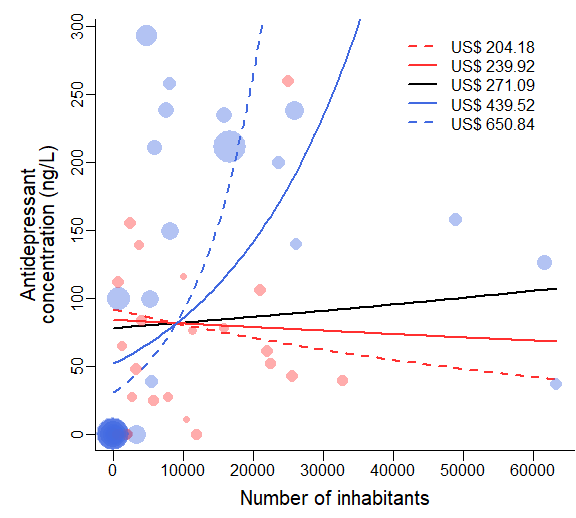

Predictors of total concentration of SNRI antidepressants in streamwater
================
Rodolfo Pelinson
2024-11-15

Packages:

``` r
library(DHARMa)
library(AICcmodavg)
library(corrplot)
library(MuMIn)
library(vegan)
library(car)
library(lme4)
library(glmmTMB)
library(dplyr)
```

A few necessary functions to make the code more straightforward:

``` r
source("C:/Users/rodol/OneDrive/repos/Antidepressants_sp/scripts/functions/plot_models_one_var.R")
source("C:/Users/rodol/OneDrive/repos/Antidepressants_sp/scripts/functions/plot_models_two_var.R")
source("C:/Users/rodol/OneDrive/repos/Antidepressants_sp/scripts/functions/confidence_interval.R")
```

Performing the model selection procedure. Note that the name of the
variables are in portuguese.

Habitantes mean inhabitants casas_sem_saneamento means houses without
sanitation renda means income.

First we make a matrix to check which pairs of variables are correlated
(more than 50%) and therefore should not be together in the same model.

``` r
source("C:/Users/rodol/OneDrive/repos/Antidepressants_sp/scripts/ajeitando_planilhas.R")

pred_mod_sel <- select(predictors,  casas_sem_saneamento, renda, habitantes)

#Standardizing response variables
Preditoras_stand <- decostand(pred_mod_sel, method = "stand")

smat <- abs(cor(Preditoras_stand)) <= .5
smat[!lower.tri(smat)] <- NA

colnames(smat) <- c(paste("cond(",colnames(smat)[1], ")", sep = ""),
                    paste("cond(",colnames(smat)[2], ")", sep = ""),
                    paste("cond(",colnames(smat)[3], ")", sep = ""))

rownames(smat) <- colnames(smat)

cor(Preditoras_stand)
```

    ##                      casas_sem_saneamento      renda habitantes
    ## casas_sem_saneamento            1.0000000 -0.3425484  0.5866546
    ## renda                          -0.3425484  1.0000000 -0.2328670
    ## habitantes                      0.5866546 -0.2328670  1.0000000

``` r
smat
```

    ##                            cond(casas_sem_saneamento) cond(renda)
    ## cond(casas_sem_saneamento)                         NA          NA
    ## cond(renda)                                      TRUE          NA
    ## cond(habitantes)                                FALSE        TRUE
    ##                            cond(habitantes)
    ## cond(casas_sem_saneamento)               NA
    ## cond(renda)                              NA
    ## cond(habitantes)                         NA

Now performing the model selection.

``` r
Preditoras_stand$SNRI <- responses$SNRI

mod_global_SNRI <- glmmTMB(SNRI ~ 
                            #area +
                            casas_sem_saneamento +
                            habitantes +
                            renda + 
                            casas_sem_saneamento:renda+
                            #casas_sem_saneamento:renda:area+
                            habitantes:renda,
                            #habitantes:renda:area+
                            #casas_sem_saneamento:area+
                            #habitantes:area+
                            #renda:area,
                          data = Preditoras_stand, family = tweedie(link = "log"), na.action = "na.fail")


dredge_modelos_SNRI <- MuMIn::dredge(mod_global_SNRI, subset = smat)
```

    ## Fixed terms are "cond((Int))" and "disp((Int))"

``` r
models <- get.models(dredge_modelos_SNRI, subset = delta < 2)

aictab(models)
```

    ## 
    ## Model selection based on AICc:
    ## 
    ##    K   AICc Delta_AICc AICcWt Cum.Wt      LL
    ## 23 6 463.24          0      1      1 -224.67

``` r
dredge_modelos_SNRI
```

    ## Global model call: glmmTMB(formula = SNRI ~ casas_sem_saneamento + habitantes + 
    ##     renda + casas_sem_saneamento:renda + habitantes:renda, data = Preditoras_stand, 
    ##     family = tweedie(link = "log"), na.action = "na.fail", ziformula = ~0, 
    ##     dispformula = ~1)
    ## ---
    ## Model selection table 
    ##    cnd((Int)) dsp((Int)) cnd(css_sem_snm) cnd(hbt) cnd(rnd)
    ## 23      4.471          +                    0.4280  0.11980
    ## 3       4.386          +                    0.2703         
    ## 14      4.896          +           0.7990           0.67000
    ## 1       4.427          +                                   
    ## 7       4.385          +                    0.2678 -0.01666
    ## 2       4.421          +          -0.1131                  
    ## 5       4.424          +                           -0.07495
    ## 6       4.415          +          -0.1552          -0.12350
    ##    cnd(css_sem_snm:rnd) cnd(hbt:rnd) df   logLik  AICc delta weight
    ## 23                            0.7793  6 -224.667 463.2  0.00  0.576
    ## 3                                     4 -228.632 466.1  2.89  0.136
    ## 14                1.717               6 -226.199 466.3  3.06  0.124
    ## 1                                     3 -230.528 467.6  4.32  0.066
    ## 7                                     5 -228.627 468.6  5.34  0.040
    ## 2                                     4 -230.307 469.5  6.24  0.025
    ## 5                                     4 -230.425 469.7  6.48  0.023
    ## 6                                     5 -230.052 471.4  8.19  0.010
    ## Models ranked by AICc(x)

Selected models include inhabitants in interaction with income.

Plotting the best models:

``` r
best_model <- models[[1]]

par(mar = c(3.5,5,1,0.1))
plot_models_two_var(model = best_model, var1 = pred_mod_sel$habitantes, var2 = pred_mod_sel$renda, trans_renda = 1.7485,
                    xlab = "Number of inhabitants", legend_x = 40000, legend_y = 300)
```


