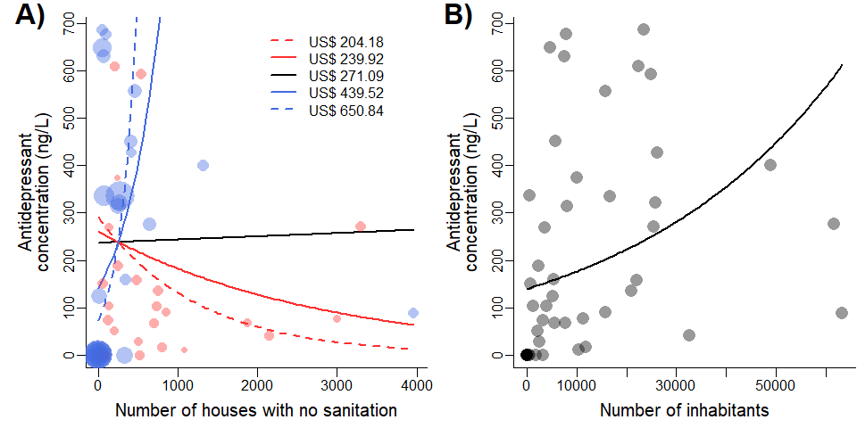

Predictors of total concentration of antidepressants in streamwater
================
Rodolfo Pelinson
2024-11-15

Packages:

``` r
library(DHARMa)
library(AICcmodavg)
library(corrplot)
library(MuMIn)
library(vegan)
library(car)
library(lme4)
library(glmmTMB)
library(dplyr)
```

A few necessary functions to make the code more straightforward:

``` r
source("C:/Users/rodol/OneDrive/repos/Antidepressants_sp/scripts/functions/plot_models_one_var.R")
source("C:/Users/rodol/OneDrive/repos/Antidepressants_sp/scripts/functions/plot_models_two_var.R")
source("C:/Users/rodol/OneDrive/repos/Antidepressants_sp/scripts/functions/confidence_interval.R")
```

Performing the model selection procedure. Note that the name of the
variables are in portuguese.

Habitantes mean inhabitants casas_sem_saneamento means houses without
sanitation renda means income.

First we make a matrix to check which pairs of variables are correlated
(more than 50%) and therefore should not be together in the same model.

``` r
source("C:/Users/rodol/OneDrive/repos/Antidepressants_sp/scripts/ajeitando_planilhas.R")

pred_mod_sel <- select(predictors,  casas_sem_saneamento, renda, habitantes)

#Standardizing response variables
Preditoras_stand <- decostand(pred_mod_sel, method = "stand")

smat <- abs(cor(Preditoras_stand)) <= .5
smat[!lower.tri(smat)] <- NA

colnames(smat) <- c(paste("cond(",colnames(smat)[1], ")", sep = ""),
                    paste("cond(",colnames(smat)[2], ")", sep = ""),
                    paste("cond(",colnames(smat)[3], ")", sep = ""))

rownames(smat) <- colnames(smat)

cor(Preditoras_stand)
```

    ##                      casas_sem_saneamento      renda habitantes
    ## casas_sem_saneamento            1.0000000 -0.3425484  0.5866546
    ## renda                          -0.3425484  1.0000000 -0.2328670
    ## habitantes                      0.5866546 -0.2328670  1.0000000

``` r
smat
```

    ##                            cond(casas_sem_saneamento) cond(renda)
    ## cond(casas_sem_saneamento)                         NA          NA
    ## cond(renda)                                      TRUE          NA
    ## cond(habitantes)                                FALSE        TRUE
    ##                            cond(habitantes)
    ## cond(casas_sem_saneamento)               NA
    ## cond(renda)                              NA
    ## cond(habitantes)                         NA

Now performing the model selection.

``` r
Preditoras_stand$all <- responses$all

mod_global_all <- glmmTMB(all ~ 
                            #area +
                            casas_sem_saneamento +
                            habitantes +
                            renda + 
                            casas_sem_saneamento:renda+
                            #casas_sem_saneamento:renda:area+
                            habitantes:renda,
                            #habitantes:renda:area+
                            #casas_sem_saneamento:area+
                            #habitantes:area+
                            #renda:area,
                          data = Preditoras_stand, family = tweedie(link = "log"), na.action = "na.fail")


dredge_modelos_all <- MuMIn::dredge(mod_global_all, subset = smat)
```

    ## Fixed terms are "cond((Int))" and "disp((Int))"

``` r
models <- get.models(dredge_modelos_all, subset = delta < 2)

aictab(models)
```

    ## 
    ## Model selection based on AICc:
    ## 
    ##    K   AICc Delta_AICc AICcWt Cum.Wt      LL
    ## 14 6 549.16       0.00   0.56   0.56 -267.63
    ## 3  4 549.60       0.44   0.44   1.00 -270.37

``` r
dredge_modelos_all
```

    ## Global model call: glmmTMB(formula = all ~ casas_sem_saneamento + habitantes + renda + 
    ##     casas_sem_saneamento:renda + habitantes:renda, data = Preditoras_stand, 
    ##     family = tweedie(link = "log"), na.action = "na.fail", ziformula = ~0, 
    ##     dispformula = ~1)
    ## ---
    ## Model selection table 
    ##    cnd((Int)) dsp((Int)) cnd(css_sem_snm) cnd(hbt) cnd(rnd)
    ## 14      5.806          +           0.9669           0.71200
    ## 3       5.202          +                    0.3485         
    ## 23      5.279          +                    0.4663  0.02429
    ## 7       5.198          +                    0.3340 -0.09238
    ## 1       5.269          +                                   
    ## 5       5.257          +                           -0.16960
    ## 2       5.263          +          -0.1129                  
    ## 6       5.245          +          -0.1764          -0.22430
    ##    cnd(css_sem_snm:rnd) cnd(hbt:rnd) df   logLik  AICc delta weight
    ## 14                 2.08               6 -267.625 549.2  0.00  0.353
    ## 3                                     4 -270.367 549.6  0.44  0.283
    ## 23                            0.5847  6 -268.687 551.3  2.12  0.122
    ## 7                                     5 -270.250 551.8  2.67  0.093
    ## 1                                     3 -272.896 552.3  3.14  0.073
    ## 5                                     4 -272.496 553.9  4.70  0.034
    ## 2                                     4 -272.699 554.3  5.11  0.027
    ## 6                                     5 -272.051 555.4  6.28  0.015
    ## Models ranked by AICc(x)

Selected models include houses without sanitaiton in interaction with
income OR just inhabitants.

Plotting the best models:

``` r
best_model <- models[[1]]
second_model <- models[[2]]

par(mfrow = c(1,2), mar = c(3.5,5,1,0.1), bty = "l")
plot_models_two_var(model = best_model, var1 = pred_mod_sel$casas_sem_saneamento, var2 = pred_mod_sel$renda, trans_renda = 1.7485)
par(new = TRUE, mar = c(0,0,0,0))
plot(NA , type = "n", xaxt = "n", yaxt = "n", xlab = "", ylab = "", bty = "n", xlim = c(0,100), ylim = c(0,100))
text(x = 0, y = 100, labels = "A)", font = 2, cex = 2, adj = 0)

par(mar = c(3.5,5,1,0.1))
plot_models_one_var(second_model, var1 = pred_mod_sel$habitantes)
par(new = TRUE, mar = c(0,0,0,0))
plot(NA , type = "n", xaxt = "n", yaxt = "n", xlab = "", ylab = "", bty = "n", xlim = c(0,100), ylim = c(0,100))
text(x = 0, y = 100, labels = "B)", font = 2, cex = 2, adj = 0)
```


