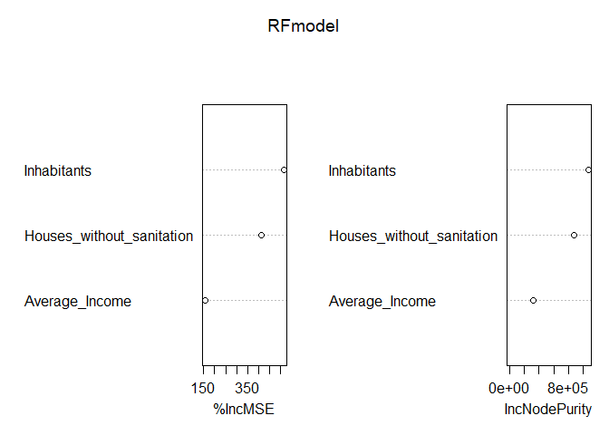
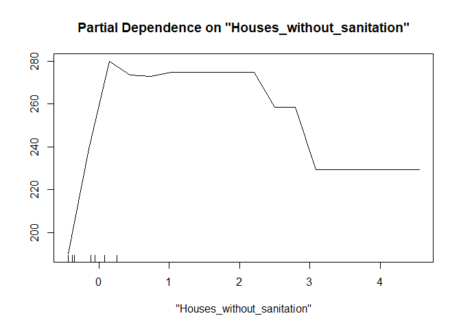

RandomForest_aproach
================
Rodolfo Pelinson
2024-11-04

# Random Forests Approach

``` r
#pred_mod_sel <- select(predictors, area, casas_sem_saneamento, renda, habitantes)
pred_mod_sel <- select(predictors_cor,  Houses_without_sanitation, Average_Income, Inhabitants)

#Padronizando
Preditoras_stand <- decostand(pred_mod_sel, method = "stand")
```

``` r
library(randomForest)

set.seed(135); RFmodel <- randomForest(all ~ Houses_without_sanitation + Average_Income + Inhabitants,
                        data = Preditoras_stand, proximity = TRUE, ntree = 100000,
                        mtry = 3, importance = TRUE)
RFmodel
```

    ## 
    ## Call:
    ##  randomForest(formula = all ~ Houses_without_sanitation + Average_Income +      Inhabitants, data = Preditoras_stand, proximity = TRUE, ntree = 1e+05,      mtry = 3, importance = TRUE) 
    ##                Type of random forest: regression
    ##                      Number of trees: 1e+05
    ## No. of variables tried at each split: 3
    ## 
    ##           Mean of squared residuals: 23857.52
    ##                     % Var explained: 49.31

``` r
varImpPlot(RFmodel)
```

<!-- -->

These are measures of variable importance. Both measures agree that the
number of houses without sanitation and the number of inhabitants in the
watershed are important variables, followed by average income, which is
also exhibits good values of importance.

``` r
partialPlot(RFmodel, Preditoras_stand, "Inhabitants")
```

<!-- -->

``` r
partialPlot(RFmodel, Preditoras_stand, "Houses_without_sanitation")
```

<!-- -->

``` r
partialPlot(RFmodel, Preditoras_stand, "Average_Income")
```

<!-- -->

The effect of the number of inhabitants seems to be generally positive.

The effect of the number of households without sanitation seems to have
a positive effect as the number of houses goes from zero to a few, but
then it strongly decreases.

Finally, average income seems to have a positive effect on total
antidepressant concentration.

Something important is that average income and number of households
without sanitation are somewhat correlated. We do observe variation in
the number of households without sanitation for the low income
watersheds, but high income watersheds only exhibit a small number of
households without sanitation. This may be the reason why we observe an
increase followed by a decrease of antidepressant concentration as we
increase the number of households without sanitation in the watershed.

``` r
plot(Preditoras_stand$Houses_without_sanitation~ Preditoras_stand$Average_Income)
abline(v = median(Preditoras_stand$Average_Income), col = "red")
```

<!-- -->

To better investigate this scenario we splitted our data set in
watersheds below (“low” income) and above (“high income”) the median of
average income.

 

 

## Splitting the data set into “low” and “high” income

### “Low” income

``` r
pred_mod_sel_low_income <- pred_mod_sel[pred_mod_sel$Average_Income <= median(pred_mod_sel$Average_Income),]
all <- responses$all[pred_mod_sel$Average_Income <= median(pred_mod_sel$Average_Income)]
Preditoras_stand <- decostand(pred_mod_sel_low_income, method = "stand")


##################################################################################################
RFmodel <- randomForest(all ~ Houses_without_sanitation + Inhabitants,
                        data = Preditoras_stand, proximity = TRUE, ntree = 100000,
                        mtry = 3, importance = TRUE)
RFmodel
```

    ## 
    ## Call:
    ##  randomForest(formula = all ~ Houses_without_sanitation + Inhabitants,      data = Preditoras_stand, proximity = TRUE, ntree = 1e+05,      mtry = 3, importance = TRUE) 
    ##                Type of random forest: regression
    ##                      Number of trees: 1e+05
    ## No. of variables tried at each split: 2
    ## 
    ##           Mean of squared residuals: 22970.43
    ##                     % Var explained: 21.77

``` r
varImpPlot(RFmodel)
```

<!-- -->

``` r
partialPlot(RFmodel, Preditoras_stand, "Houses_without_sanitation")
```

<!-- -->

``` r
#partialPlot(RFmodel, Preditoras_stand, "Average_Income")
partialPlot(RFmodel, Preditoras_stand, "Inhabitants")
```

<!-- -->

For the low income data set the effect the effects seems similar to the
whole data set.

 

 

### “High” income

``` r
pred_mod_sel_high_income <- pred_mod_sel[pred_mod_sel$Average_Income >= median(pred_mod_sel$Average_Income),]
all <- responses$all[pred_mod_sel$Average_Income >= median(pred_mod_sel$Average_Income)]
Preditoras_stand <- decostand(pred_mod_sel_high_income, method = "stand")


##################################################################################################
RFmodel <- randomForest(all ~ Houses_without_sanitation + Inhabitants,
                        data = Preditoras_stand, proximity = TRUE, ntree = 100000,
                        mtry = 3, importance = TRUE)
RFmodel
```

    ## 
    ## Call:
    ##  randomForest(formula = all ~ Houses_without_sanitation + Inhabitants,      data = Preditoras_stand, proximity = TRUE, ntree = 1e+05,      mtry = 3, importance = TRUE) 
    ##                Type of random forest: regression
    ##                      Number of trees: 1e+05
    ## No. of variables tried at each split: 2
    ## 
    ##           Mean of squared residuals: 21962.95
    ##                     % Var explained: 63.56

``` r
varImpPlot(RFmodel)
```

<!-- -->

``` r
partialPlot(RFmodel, Preditoras_stand, "Houses_without_sanitation")
```

<!-- -->

``` r
#partialPlot(RFmodel, Preditoras_stand, "Average_Income")
partialPlot(RFmodel, Preditoras_stand, "Inhabitants")
```

<!-- -->

For the high income data set both number of inhabitants and number of
households without sanitation have general positive effects on total
antidepressant concentration, with a small decrease at the end of the
gradient for the number of households without sanitation.

## Conclusion

Apparently, the effect of the number of households without sanitation is
generally negative for the lower portion of average income and positive
for the upper portion. The number of inhabitants is always positively
correlated to the total concentration of antidepressants.
