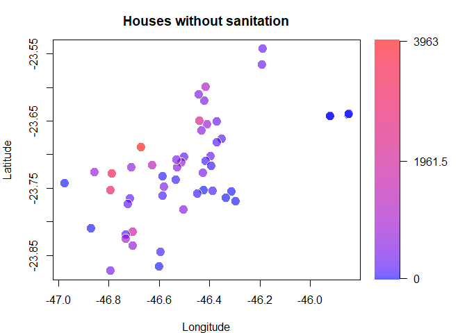
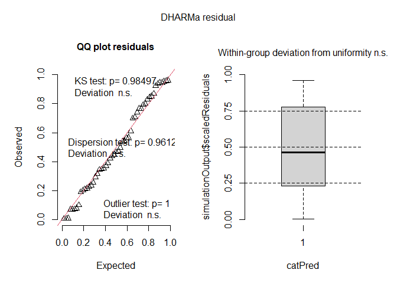
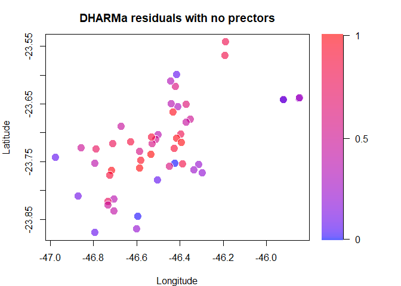
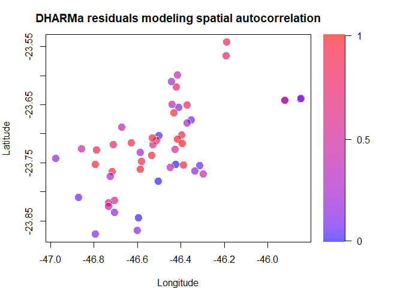
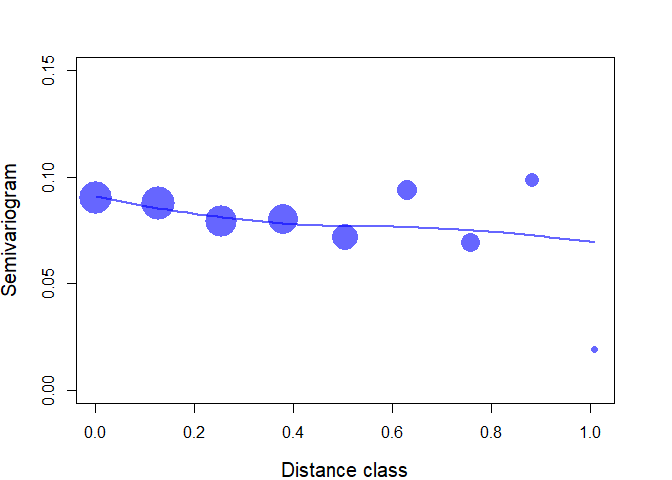
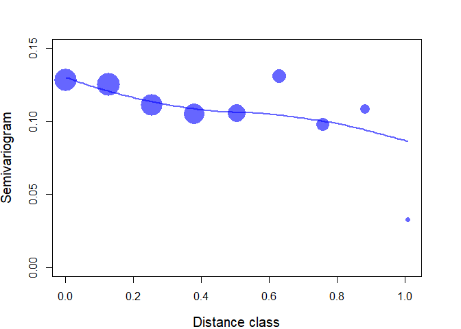

Spatial Analyses
================
Rodolfo Pelinson
2024-11-06

## Plots of the spatial structure of predictors and response variables

Functions necessary for the following plots:

``` r
plot_spatial_pattern <- function(y, main = "", close.screens = TRUE, letter = NULL, ...){
  matrix <- matrix(data = c(0,.8,0,1,
                          .8,1,0,1), nrow = 2, ncol = 4, byrow = TRUE)

screens <- split.screen(matrix)

screen(screens[1])
par(mar = c(4,4,3,1))

pal <- col_numeric(
        palette = c(alpha("blue", 0.6), alpha("red", 0.6)),
        domain = y,
        na.color = "grey50",
        alpha = TRUE,
        reverse = FALSE)

y_col <- pal(y)

plot(coord$longitude, coord$latitude, xlab = "Longitude", ylab = "Latitude", pch = 21, bg = y_col, cex = 2, col = FALSE, main = main, ...)


if(is.null(letter) == FALSE){
par(new = TRUE, mar = c(0,0,0,0))
plot(NA , type = "n", xaxt = "n", yaxt = "n", xlab = "", ylab = "", bty = "n", xlim = c(0,100), ylim = c(0,100))
text(x = 0, y = 100, labels = letter, font = 2, cex = 2, adj = 0)
}


screen(screens[2])

legend<-seq(min(y), max(y), length.out = 100)


par(mar = c(4,0.1,3,5))
image(y = 1:length(legend),x = 1, z = t(as.matrix(1:length(legend))),
          col = pal(legend),
          axes = FALSE, xlab = "", ylab = "", xlim = c(0,1))
axis(4, at = c(1, length(legend)/2,length(legend)), labels = round(legend[c(1,length(legend)/2,length(legend))],1), las = 2,
         cex.axis = 1, tick = TRUE, line = 0)

if(isTRUE(close.screens)){
  close.screen(all.screens = TRUE)
}


}
```

``` r
colapsed_variogram <- function(variogram, dist_classes = 10){
  variogram <- variogram[order(variogram$dist),]
  new_seq <- seq(min(variogram$dist), max(variogram$dist), length.out = dist_classes)
  new_variogram <- rep(NA, length(new_seq)-1)
  n <- rep(NA, length(new_seq)-1)
  for(i in 1:(length(new_seq) - 1)){
    new_variogram[i] <- mean(variogram$variog[variogram$dist >= new_seq[i] & variogram$dist < new_seq[i+1]])
    n[i] <- length(variogram$variog[variogram$dist >= new_seq[i] & variogram$dist < new_seq[i+1]])
  }
  new_variogram <- data.frame(variog = new_variogram, dist = new_seq[-length(new_seq)], n = n)
  class(new_variogram) <- class(variogram)
  return(new_variogram)
}

plot_variogram <- function(variogram, letter = NULL, weights = FALSE, ...){
if(isTRUE(weights)){
  weights <- variogram$n
  cex <- log(weights/min(weights))+1
}else{
  weights <- NULL
  cex <- 1.5
}
par(mar = c(4,4,3,3))
plot(variogram$variog ~ variogram$dist, ylab = "Semivariogram",
     xlab = "Distance class", col = alpha("blue", 0.6), cex = cex, pch = 16, ylim = c(0,0.15), ...)
newdata <- data.frame(variog = seq(min(variogram$dist), max(variogram$dist), length.out = 100))
loess_var <- loess(variog ~ dist, data = variogram, span = 1.25, weights = weights)
predicted <- predict(loess_var, newdata = as.matrix(newdata))
lines(newdata$variog,predicted, lwd = 2, col = alpha("blue", 0.6))
if(is.null(letter) == FALSE){
par(new = TRUE, mar = c(0,0,0,0))
plot(NA , type = "n", xaxt = "n", yaxt = "n", xlab = "", ylab = "", bty = "n", xlim = c(0,100), ylim = c(0,100))
text(x = 0, y = 100, labels = letter, font = 2, cex = 2, adj = 0)
}
}
```

This is just the spatial patterns of the most important predictor
variables that we have.

``` r
plot_spatial_pattern(predictors$casas_sem_saneamento, main = "Houses without sanitation")
```

<!-- -->

``` r
plot_spatial_pattern(predictors$habitantes, main = "Inhanitants")
```

<!-- -->

``` r
plot_spatial_pattern(predictors$renda, main = "Per capita average income")
```

<!-- -->  

As we can see, these variables do have some opposite spatial patterns.
Specifically, the total number of houses without sanitation and total
number of inhabitants exhibit opposite patterns to the per capita
average income.  

``` r
plot_spatial_pattern(responses$all, main = "Antidepressant concentration")
```

<!-- -->

``` r
plot_spatial_pattern(responses$SNRI, main = "SNRI Antidepressant concentration")
```

<!-- -->

``` r
plot_spatial_pattern(responses$Aminoketone, main = "Aminoketone Antidepressant concentration")
```

<!-- -->

``` r
plot_spatial_pattern(responses$SSRI, main = "SSRI Antidepressant concentration")
```

<!-- -->

``` r
plot_spatial_pattern(responses$Tricyclic, main = "Tricyclic Antidepressant concentration")
```

<!-- -->

These are the spatial patterns found for antidepressant concentration.
It seems that the ones with high concentration are concentrated in the
center of the distribution.    

## Analysis for the total concentration of antidepressants

First let’s find the best model to predict the total concentration of
antidepressants.

``` r
#pred_mod_sel <- select(predictors, area, casas_sem_saneamento, renda, habitantes)
pred_mod_sel <- select(predictors,  casas_sem_saneamento, renda, habitantes)

#Padronizando
Preditoras_stand <- decostand(pred_mod_sel, method = "stand")

#construindo uma matriz que indica quais combinações de variaveis tem correlação acima de 0.5 ou abaixo de -0.5
smat <- abs(cor(Preditoras_stand)) <= .5
smat[!lower.tri(smat)] <- NA

colnames(smat) <- c(paste("cond(",colnames(smat)[1], ")", sep = ""),
                    paste("cond(",colnames(smat)[2], ")", sep = ""),
                    paste("cond(",colnames(smat)[3], ")", sep = ""))
                    #paste("cond(",colnames(smat)[4], ")", sep = ""))

rownames(smat) <- colnames(smat)


###############################################
###############################################
####### TODOS OS ANTIDEPRESSIVOS ##############

Preditoras_stand$all <- responses$all

#Modelol global
mod_global_all <- glmmTMB(all ~ 
                            #area +
                            casas_sem_saneamento +
                            habitantes +
                            renda + 
                            casas_sem_saneamento:renda+
                            #casas_sem_saneamento:renda:area+
                            habitantes:renda,
                            #habitantes:renda:area+
                            #casas_sem_saneamento:area+
                            #habitantes:area+
                            #renda:area,
                          data = Preditoras_stand, family = tweedie(link = "log"), na.action = "na.fail")


#fazendo todas as combinações possíveis

dredge_modelos_all <- MuMIn::dredge(mod_global_all, subset = smat)
```

    ## Fixed terms are "cond((Int))" and "disp((Int))"

``` r
models <- get.models(dredge_modelos_all, subset = delta < 2)

best_model <- models[[1]]

best_model
```

    ## Formula:          
    ## all ~ casas_sem_saneamento + renda + casas_sem_saneamento:renda +      1
    ## Data: Preditoras_stand
    ##       AIC       BIC    logLik  df.resid 
    ##  547.2504  558.8413 -267.6252        45 
    ## 
    ## Number of obs: 51
    ## 
    ## Dispersion parameter for tweedie family (): 27.4 
    ## 
    ## Tweedie power estimate:  1.4 
    ## 
    ## Fixed Effects:
    ## 
    ## Conditional model:
    ##                (Intercept)        casas_sem_saneamento  
    ##                     5.8056                      0.9669  
    ##                      renda  casas_sem_saneamento:renda  
    ##                     0.7120                      2.0802

With the best model found, we will check for spatial patterns in a model
without predictors, in our best model, and in our best model with the
addition of spatial autocorrelation.

``` r
set.seed(45)
library(DHARMa)
library(nlme)

Preditoras_stand$pos <- numFactor(coord$longitude, coord$latitude)
Preditoras_stand$group <- rep("A", nrow(Preditoras_stand))

mod_no_effect <- glmmTMB(all ~ 1,data = Preditoras_stand, family = tweedie(link = "log"), na.action = "na.fail")
mod_auto_correlation <- glmmTMB(all ~ casas_sem_saneamento * renda + exp(pos + 0|group),data = Preditoras_stand, family = tweedie(link = "log"), na.action = "na.fail")

resid_no_effect <- simulateResiduals(mod_no_effect, n = 10000, rotation = "estimated")
resid_all <- simulateResiduals(best_model, n = 10000, rotation = "estimated")
resid_auto_correlation <- simulateResiduals(mod_auto_correlation, n = 10000, rotation = "estimated")

plot(resid_no_effect)
```

<!-- -->

``` r
plot(resid_all)
```

<!-- -->

``` r
plot(resid_auto_correlation)
```

<!-- -->

``` r
testSpatialAutocorrelation(resid_no_effect, x = coord$longitude, y = coord$latitude, plot = FALSE)
```

    ## 
    ##  DHARMa Moran's I test for distance-based autocorrelation
    ## 
    ## data:  resid_no_effect
    ## observed = 0.129632, expected = -0.020000, sd = 0.054844, p-value =
    ## 0.006366
    ## alternative hypothesis: Distance-based autocorrelation

``` r
testSpatialAutocorrelation(resid_all, x = coord$longitude, y = coord$latitude, plot = FALSE)
```

    ## 
    ##  DHARMa Moran's I test for distance-based autocorrelation
    ## 
    ## data:  resid_all
    ## observed = 0.077076, expected = -0.020000, sd = 0.054740, p-value =
    ## 0.07616
    ## alternative hypothesis: Distance-based autocorrelation

``` r
testSpatialAutocorrelation(resid_auto_correlation, x = coord$longitude, y = coord$latitude, plot = FALSE)
```

    ## 
    ##  DHARMa Moran's I test for distance-based autocorrelation
    ## 
    ## data:  resid_auto_correlation
    ## observed = 0.030199, expected = -0.020000, sd = 0.055002, p-value =
    ## 0.3614
    ## alternative hypothesis: Distance-based autocorrelation

``` r
plot_spatial_pattern(resid_no_effect$scaledResiduals, main = "DHARMa residuals with no prectors")
```

<!-- -->

``` r
plot_spatial_pattern(resid_all$scaledResiduals, main = "DHARMa residuals for the best model")
```

<!-- -->

``` r
plot_spatial_pattern(resid_auto_correlation$scaledResiduals, main = "DHARMa residuals modeling spatial autocorrelation")
```

<!-- -->

``` r
var_no_effect <- Variogram(resid_no_effect$scaledResiduals, distance = dist(coord[,2:3]))
var_no_effect_colapsed <- colapsed_variogram(var_no_effect)

var <- Variogram(resid_all$scaledResiduals, distance = dist(coord[,2:3]))
var_colapsed <- colapsed_variogram(var)

var_auto_cor <- Variogram(resid_auto_correlation$scaledResiduals, distance = dist(coord[,2:3]))
var_auto_cor_colapsed <- colapsed_variogram(var_auto_cor)

plot_variogram(var_no_effect_colapsed, cex.lab = 1.25, cex.main =1.5, weights = TRUE)
```

<!-- -->

``` r
plot_variogram(var_colapsed, cex.lab = 1.25, cex.main =1.5, weights = TRUE)
```

<!-- -->

``` r
plot_variogram(var_auto_cor_colapsed, cex.lab = 1.25, cex.main =1.5, weights = TRUE)
```

<!-- -->

## Conclusion

As we can see, our model do eliminate most of the spatial patterns
observed in our response variable. When we look at the Semivariograms we
can see that our best model is sufficient to eliminate a pattern of
increase in semivariance with distance. In fact, we are left with a
pattern of decrease in semivariance for samples that are very far apart.
Meaning that samples far apart are more similar that samples close to
each other. The probable explanation for that is that forested
watersheds mostly occur at the margins of our sample design.
Unfortunately, this could not be accounted for the available spatial
autocorrelation structures.
